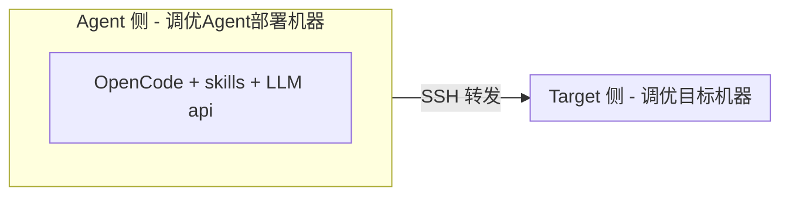

# witty-opentunex

The witty-opentunex is a tool designed for OS tuning, providing top-down bottleneck analysis and scenario tuning skills based on LLM.

支持基于 SSH 自动在远程目标机器执行 OS 性能瓶颈分析&调优。

## 架构



**说明**：Agent 需部署于可访问 LLM api 机器；Agent 需可通过 SSH 连接 Target.

---

## Target 侧依赖安装
```sh
# 安装系统性能分析工具
yum install -y sysstat util-linux iproute bc numactl ethtool iotop strace perf net-tools

# 安装性能基准测试工具
yum install -y sysbench fio iperf3

# 安装数据库客户端
yum install -y mysql postgresql redis

# 安装文件系统工具
yum install -y e2fsprogs xfsprogs btrfs-progs
```

---

## Agent 侧安装启动

安装 opencode：
```sh
yum install nodejs
npm install -g opencode-ai
```
参考：https://opencode.ai/docs/zh-cn/

安装调优skills:
```sh
mkdir -p ~/.config/opencode/skills/
cp skills/* ~/.config/opencode/skills/
# 或创建软链接
# cd skills && for skill in *; do ln -s ~/.config/opencode/skills/${skill} $(pwd)/${skill}; done
```

在 Agent 侧启动 opencode 调优：
```sh
cd agentspace/
opencode
```

开始性能分析/调优：

1、输入：`/skills` 选择 top-down-bottleneck 瓶颈分析或 os-performance-optimization 性能优化skill

2、输入：帮我分析xx.xx.xx.xx机器上xx负载场景的性能瓶颈/帮我优化xx.xx.xx.xx机器上xx负载场景的性能

3、根据提示信息，输入用户名密码，为目标调优机器建立 SSH 无密码连接，同意提示需要的权限

4、运行待优化场景的benchmark负载（当前需手动反复运行benchmark保持到分析结束）

5、等待opentunex 调优Agent进行自动化分析，报告输出瓶颈分析结果/优化建议。


