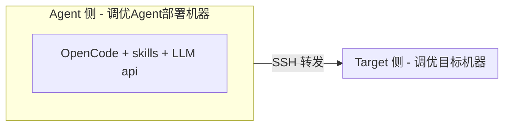

# witty-opentunex

The witty-opentunex is a tool designed for OS tuning, providing top-down bottleneck analysis and scenario tuning skills based on LLM.

支持通过自动/手动采集方式针对远程目标机器进行 OS 层性能瓶颈分析&调优。

## 架构



**说明**：Agent 需部署于可访问 LLM api 机器；Agent 需可通过 SSH 连接 Target（自动采集模式）。

---

## Target 侧依赖安装
```sh
# 安装系统性能分析工具
yum install -y sysstat util-linux iproute bc numactl ethtool iotop strace perf net-tools
```

---

## Agent 侧安装启动

安装 opencode：
```sh
yum install nodejs
# 配置国内npm镜像源：npm config set registry https://registry.npmmirror.com
npm install -g opencode-ai
```
opencode安装&使用参考文档：https://opencode.ai/docs/zh-cn/

注1：opencode 需要 TUI 环境运行，推荐 vscode terminal 或 Win11 Terminal 终端下 SSH 连接到 Agent 机器上运行。

注2：opencode 需要配置 LLM 提供商，推荐外网环境配置，配置方法参考：https://opencode.ai/docs/zh-cn/models/#%E6%8F%90%E4%BE%9B%E5%95%86

注3：调优skills推荐使用 GLM-4.7 或 Minimax-M2.7 以上能力的模型（一般需要上下文长度>80K），购买链接：
- glm：https://bigmodel.cn/glm-coding
- minimax：https://platform.minimaxi.com/subscribe/token-plan

安装调优skills:
```sh
mkdir -p ~/.config/opencode/skills/

# 安装所有skills（跳过分类目录）
for skill in skills/*/*/; do
    cp -r "$skill" ~/.config/opencode/skills/
done

# 仅安装OS层瓶颈分析：
cp -r skills/auxiliary/opentunex-remote-execution ~/.config/opencode/skills/
cp -r skills/bottleneck/opentunex-{top-down,sched,lock,io,mem,net}-bottleneck ~/.config/opencode/skills/
```

安装 opentunex-assistant agent：

```BASH
mkdir -p ~/.config/opencode/agents/
cp agents/opentunex-assistant.md ~/.config/opencode/agents/
```

在 Agent 侧启动 opencode 调优：

```sh
# 提供一个独立空间，可用于存放报告
mkdir -p agentspace
cd agentspace/
opencode
```

## 全自动化模式性能诊断

适用场景：调优目标环境可由调优Agent部署机器SSH连接。

性能瓶颈分析/调优步骤：

1、建立 `调优Agent机器` 到 `调优目标机器` 的 SSH 秘钥连接；否则后续对话中需输入机器连接信息，由LLM自动为目标调优机器建立 SSH 无密码连接（不推荐，密码会传给LLM）。

2、调优目标环境运行benchmark负载（建议循环运行benchmark直到分析结束）

3、启动调优Agent会话，输入：

```
## 任务说明
当前需要从操作系统层面分析目标环境的性能瓶颈、优化建议，输出一份瓶颈链充分的诊断报告。

## 采集模式
- 自动：直接在调优目标环境中自动运行需要的采集命令，目标环境为IP【例如 XX.XX.XX.XX】。

## 场景指标
测试场景为【例如 mysql sysbench】，优化指标为【例如 tps】。

## 其他说明
- 压测方式：【例如 wrk -t4 -c200 -d60s / Jmeter 并发 500】（可选输入）
- 约束限制：【例如 不可调节应用层配置参数、benchmark参数】（可选输入）
- 异常表现：【例如 p99 延迟从 50ms 剧增到 800ms，CPU 使用率仅 35%】（可选输入）
```

4、等待调优Agent进行自动化分析，报告输出瓶颈分析结果/优化建议。

## 半自动化模式性能诊断

适用场景：调优目标环境无法SSH连接到调优Agent部署环境，仅能手动采集数据后传到调优Agent环境分析。

性能瓶颈分析/调优步骤：

1、调优目标环境运行benchmark负载（建议循环运行benchmark直到分析结束），并上传scripts目录下所有脚本后运行 `bash opentunex-collect-metrics-all.sh`。

2、收集目标环境上的采集日志 `/tmp/opentunex-profiling-XXX` ，传回调优Agent环境中。

3、启动调优Agent会话，输入：

```
## 任务说明
当前需要从操作系统层面分析目标环境的性能瓶颈、优化建议，输出一份瓶颈链充分的诊断报告。

## 采集模式
- 手动：远程调优目标环境无法自动连接，数据需要人工手动采集，当前采集数据已放置在目录【例如 /tmp/opentunex-profiling-XXX】。

## 场景指标
测试场景为【例如 mysql sysbench】，优化指标为【例如 tps】。

## 其他说明
- 压测方式：【例如 wrk -t4 -c200 -d60s / Jmeter 并发 500】（可选输入）
- 约束限制：【例如 不可调节应用层配置参数、benchmark参数】（可选输入）
- 异常表现：【例如 p99 延迟从 50ms 剧增到 800ms，CPU 使用率仅 35%】（可选输入）
```

4、等待调优Agent进行自动化分析，报告输出瓶颈分析结果/优化建议；若需要进一步的采集，则Agent会给出下一步需执行的采集脚本，新采集脚本传到目标环境之后重复第1步。
