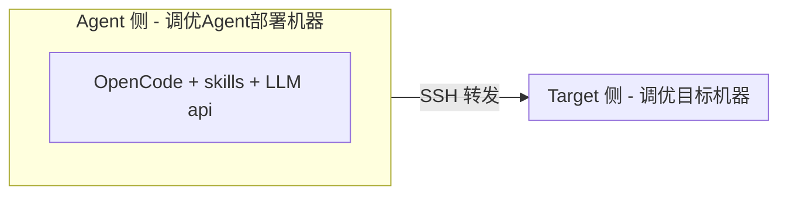

# witty-opentunex

The witty-opentunex is a tool designed for OS tuning, providing top-down bottleneck analysis and scenario tuning skills based on LLM.

支持基于 SSH 自动在远程目标机器执行 OS 性能瓶颈分析&调优。

## 架构



**说明**：Agent 需部署于可访问 LLM api 机器；Agent 需可通过 SSH 连接 Target.

---

## Target 侧依赖安装
```sh
# 安装系统性能分析工具
yum install -y sysstat util-linux iproute bc numactl ethtool iotop strace perf net-tools
```

---

## Agent 侧安装启动

安装 opencode：
```sh
yum install nodejs
# 配置国内npm镜像源：npm config set registry https://registry.npmmirror.com
npm install -g opencode-ai
```
opencode安装&使用参考文档：https://opencode.ai/docs/zh-cn/

注1：opencode 需要 TUI 环境运行，推荐 vscode terminal 或 Win11 Terminal 终端下 SSH 连接到 Agent 机器上运行。

注2：opencode 需要配置 LLM 提供商，推荐外网环境配置，配置方法参考：https://opencode.ai/docs/zh-cn/models/#%E6%8F%90%E4%BE%9B%E5%95%86

注3：调优skills推荐使用 GLM-4.7 或 Minimax-M2.7 以上能力的模型，购买链接：
- glm：https://bigmodel.cn/glm-coding
- minimax：https://platform.minimaxi.com/subscribe/token-plan

安装调优skills:
```sh
mkdir -p ~/.config/opencode/skills/
# 遍历每个skill目录，安装到skills/根目录（跳过分类目录）
for skill in skills/*/*/; do
    cp -r "$skill" ~/.config/opencode/skills/
done
# Skills目录结构（repo内分类，仅用于组织）：
#   bottleneck/     - 瓶颈分析 (top-down, io, mem, net, lock, sched, application)
#   optimization/  - 性能优化 (os, application, inference)
#   auxiliary/     - 辅助功能 (remote-execution, benchmark, enablement)
```

安装 opentunex-assistant agent：

```BASH
mkdir -p ~/.config/opencode/agents/
cp agents/opentunex-assistant.md ~/.config/opencode/agents/
```

在 Agent 侧启动 opencode 调优：

```sh
# 提供一个独立空间，可用于存放报告
mkdir -p agentspace
cd agentspace/
opencode
```

## 全自动化模式性能诊断

适用场景：自有环境可连接LLM api，可直接SSH连接到调优环境。

性能瓶颈分析/调优步骤：

1、输入：`/skills` 选择 top-down-bottleneck 瓶颈分析或 os-performance-optimization 性能优化skill

2、输入：帮我分析xx.xx.xx.xx机器上xx负载场景的性能瓶颈/帮我优化xx.xx.xx.xx机器上xx负载场景的性能

3、提前建立目标机器的 SSH 无密码连接，或根据对话提示，输入机器连接信息，将自动为目标调优机器建立 SSH 无密码连接，对话过程中同意需要的相关权限

4、运行待优化场景的benchmark负载（当前需手动反复运行benchmark保持到分析结束）

5、等待opentunex 调优Agent进行自动化分析，报告输出瓶颈分析结果/优化建议。

## 半自动化模式性能诊断

适用场景：调优环境隔离，无法部署Agent进行SSH连接和LLM api接入，仅可手动采集数据后、经客户同意传回到本地机器后做分析。

性能瓶颈分析/调优步骤：

1、使用TAB键切换agent：选择 opentunex-assistant agent

2、输入：{(可选)初步负载采集数据已存放在 /tmp/data_collect_XXX 文件夹下，} 帮我分析XX负载环境上的OS性能瓶颈/帮我优化XX负载环境上的性能

3、Agent加载需要的相关skill，自动化分析后，给出瓶颈分析结果/优化建议，或下一步需执行的采集脚本

4、脚本复制到客户环境执行(需保证benchmark负载执行中)，执行结果通过飞书等软件传回本地机器，保存到某个路径下

5、输入：采集脚本结果存放在 xxx.txt 文件内

6、等待opentunex-assistant agent进行迭代分析，给出瓶颈分析结果/优化建议，或下一步采集计划。
