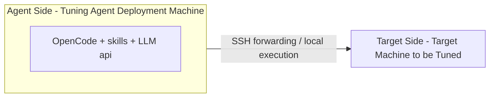
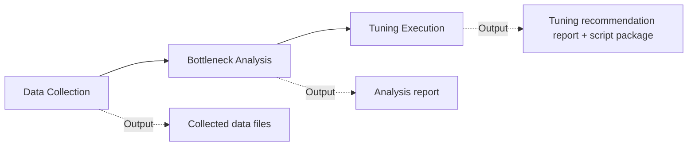

# witty-opentunex User Guide

## Overview

`witty-opentunex` is an intelligent tuning skills toolkit for Linux operating systems. It combines the reasoning capabilities of LLMs with system-level performance analysis to perform top-down bottleneck localization and scenario-based tuning on the target machine, and produces directly executable tuning recommendations.

### Project Positioning

- **OS-level Bottleneck Analysis**: Specialized bottleneck identification across multiple dimensions including CPU, memory, IO, network, scheduling, and locks.
- **Scenario-based Tuning**: NUMA scheduling, task stealing, dynamic SMT, Docker compute coordination, domain-divided scheduling, NIC multi-path, copy optimization, BTB (Branch Target Buffer), hisock network acceleration, and more.
- **Executable Tuning**: Generates tuning scripts and rollback plans based on bottleneck analysis results, applied after user confirmation.

### Overall Architecture



- **Agent Side**: Deploys the OpenCode runtime environment and the skills provided by this project (including meta-skills, data collection, bottleneck analysis, tuning execution, remote execution, etc.), and performs reasoning through the LLM API.
- **Target Side**: The Linux server to be tuned (in fully-automated mode, reached by the Agent Side via SSH; in semi-automated mode, the user manually collects data and copies it to the Agent Side).
- **Constraints**: The Agent machine must be able to access the LLM API; the Agent must be able to SSH to the Target (in fully-automated mode).

### Three-Stage Workflow

`witty-opentunex` strictly follows the sequence of "**Data Collection → Bottleneck Analysis → Tuning Execution**". Stages cannot be skipped or reversed:



| Stage | Entry Skill | Output |
|-------|-------------|--------|
| Data Collection | `opentunex-data-collection` | OS configuration and performance data files under `${WORK_DIR}/collect/` |
| Bottleneck Analysis | `opentunex-bottleneck-analysis` | Generic + scenario-based analysis reports under `${WORK_DIR}/analysis/` |
| Tuning Execution | `opentunex-performance-tuning` | `${WORK_DIR}/tuning/tuning-report.md` tuning report + `tuning-package_<timestamp>.tar.gz` tuning toolkit (containing the tuning report and executable tuning scripts) |

The meta-skill `witty-opentunex` is the unified orchestration entry point for the three stages above, responsible for mode determination, directory initialization, and stage transition validation.

### Applicable Scenarios

- Applications such as databases, caches, and message queues experience performance bottlenecks at the OS level, requiring rapid root cause localization and effective tuning solutions.
- Inference / LLM services have saturated GPU resources and want to further squeeze the host's CPU / memory / network performance.
- Container / cluster scenarios requiring system-level tuning such as NUMA, scheduling, and CPU pinning.

---

## Installation

### Target Machine Dependencies

On the target Linux server to be tuned, basic system performance analysis tools need to be installed. The scripts executed during the data collection phase of `witty-opentunex` depend on the following commands:

```sh
yum install -y sysstat util-linux iproute bc numactl ethtool iotop strace perf net-tools
```

| Command | Purpose |
|---------|---------|
| `mpstat` / `iostat` / `vmstat` / `sar` / `pidstat` | From sysstat, used for CPU / IO / global resource metric collection |
| `perf` | Hotspot functions, microarchitecture, PMU, and other in-depth analysis |
| `strace` | System call analysis |
| `numactl` | NUMA topology and affinity |
| `ethtool` | NIC queues, IRQ, offload, etc. |
| `iotop` | Per-process IO monitoring |
| `iproute2` (`ip` / `ss`) | Network protocol stack and connection states |
| `net-tools` (`netstat`) | Network statistics compatibility |

> It is recommended to run data collection as root; under non-root, collection items such as `perf` and `strace` will be restricted.

### Agent Machine Installation

The Agent side needs to install OpenCode + LLM API access + project skills.

#### Step 1: Install OpenCode

Configure the yum source for openEuler-26.09, then install with yum.

```sh
yum install opencode
```

#### Step 2: Configure the LLM Provider

OpenCode requires an LLM provider to be configured. For details, see: <https://opencode.ai/docs/models/#providers>

The tuning skills recommend using models with capability of **GLM-4.7** or **MiniMax-M2.7** or above (typically requiring a context length > 200K).

#### Step 3: Install the Tuning Skills

Configure the yum source for openEuler-26.09, then install with yum.

```sh
yum install witty-opentunex
```

After successful installation, all skills of `witty-opentunex` will be installed to the OpenCode skills configuration directory `~/.opencode/skills/`.

#### Step 4: Launch OpenCode

```sh
# Provide an independent workspace for storing tuning reports
mkdir -p agentspace
cd agentspace/
opencode
```

Once inside the OpenCode interactive interface, you can start tuning.

---

## How to Use

### Fully-Automated Mode (Recommended)

**Applicable Scenario**: The tuning target environment is reachable via SSH from the tuning Agent deployment machine.

**Prerequisite**: Establish passwordless SSH from the `tuning Agent machine` to the `tuning target machine`. If passwordless SSH is not configured, you can run `ssh-keygen -t rsa` + `ssh-copy-id ${user}@${ip}`.

**Steps**:

1. **Run the load test**: Run a benchmark on the tuning target environment, **recommended to run in a loop** until analysis is complete.
2. **Launch the tuning Agent session**: Select the `witty-opentunex` meta-skill in OpenCode.
3. **Fill in the task description**: Refer to the template

   1. ```
      ## Task Description
      We need to analyze performance bottlenecks and optimization recommendations for the target environment at the operating system level, and produce a diagnostic report with a sufficient bottleneck chain.
      
      ## Collection Mode
      - Automatic: directly run the required collection commands on the tuning target environment. The target IP is [e.g. XX.XX.XX.XX], running as root.
      
      ## Scenario Metrics
      The test scenario is [e.g. mysql sysbench], and the optimization target is [e.g. tps].
      
      ## Other Notes
      - Load test method: [e.g. wrk -t4 -c200 -d60s / Jmeter with 500 concurrent] (optional)
      - Constraints: [e.g. cannot modify application-level configuration parameters or benchmark parameters] (optional)
      - Symptoms: [e.g. p99 latency jumped from 50ms to 800ms, while CPU usage is only 35%] (optional)
      ```
4. **Wait for the agent's automatic analysis**: Data Collection → Bottleneck Analysis → Tuning Execution are executed in sequence. The report is finally output to `${WORK_DIR}/tuning/tuning-report.md`, and the tuning report and execution scripts are automatically packaged as `tuning-package_<timestamp>.tar.gz`.
5. **Manual confirmation and application**: After the agent produces tuning recommendations, it will wait for user confirmation, and then the user decides whether to execute `apply`.

### Semi-Automated Mode (Manual Collection)

**Applicable Scenario**: The tuning target environment cannot be reached via SSH from the tuning Agent deployment environment, and data can only be manually collected and transferred back to the Agent environment for analysis.

**Steps**:

1. **Run the load test**: Run a benchmark on the tuning target environment, **recommended to run in a loop** until analysis is complete.

2. **Data Collection**: Two methods

   1. **Method 1**: Use the data collection script

      1. Download the data collection script on the target machine: https://gitcode.com/openeuler/witty-opentunex/blob/master/skills/data-collection/opentunex-data-collection/scripts/bottleneck_data_collector.sh
      2. Execute the collection script

         ```sh
         # Default (without specifying PID)
         bash bottleneck_data_collector.sh -d 60 -o ${WORK_DIR}/collect
         
         # Specify a single active PID (required for hotspot / syscall analysis)
         APP_PID=$(pgrep -a "$APP_NAME" | awk '$2!="Z" {print $1; exit}')
         bash bottleneck_data_collector.sh -d 60 -p "$APP_PID" -o ${WORK_DIR}/collect
         ```

         | Parameter   | Description                                                |
         | ----------- | ---------------------------------------------------------- |
         | `-d <sec>`  | Collection duration in seconds                            |
         | `-p <PID>`  | Monitored process ID (only one active PID, **no comma separation**) |
         | `-o <dir>`  | Output directory                                           |
         | `-c <items>`| Collection items, comma-separated; default is all          |
         | `-C`        | Pre-flight check only, do not execute collection           |
         | `-h`        | Show help information                                      |
   2. **Method 2**: Use the `opentunex-data-collection` skill

      1. Prerequisite: `witty-opentunex` has been installed on the target machine
      2. Launch OpenCode on the target machine, select the `opentunex-data-collection` skill, and enter the prompt `Help me collect the current system performance data`
      3. After the agent completes the collection task, retrieve the data files from the output directory path

3. **Transfer data back**: Copy the entire data collection directory to the Agent side.

4. **Launch the tuning Agent session**: Select the `witty-opentunex` meta-skill in OpenCode.

5. **Fill in the task description**: Refer to the template

   1. ```
      ## Task Description
      We need to analyze performance bottlenecks and optimization recommendations for the target environment at the operating system level, and produce a diagnostic report with a sufficient bottleneck chain.
      
      ## Collection Mode
      - Manual: The remote tuning target environment cannot be connected automatically, so data needs to be collected manually. The currently collected data is placed in the directory [e.g. /tmp/opentunex-profiling-XXX].
      
      ## Scenario Metrics
      The test scenario is [e.g. mysql sysbench], and the optimization target is [e.g. tps].
      
      ## Other Notes
      - Load test method: [e.g. wrk -t4 -c200 -d60s / Jmeter with 500 concurrent] (optional)
      - Constraints: [e.g. cannot modify application-level configuration parameters or benchmark parameters] (optional)
      - Symptoms: [e.g. p99 latency jumped from 50ms to 800ms, while CPU usage is only 35%] (optional)
      ```

6. **Wait for analysis**: When data is incomplete, the agent will provide the next-step supplementary collection script snippet. Run it on the target environment as instructed and transfer the results back.

7. **Manual confirmation and application**: After the agent produces tuning recommendations, it will wait for user confirmation, and then the user decides whether to execute `apply`.

### Output Files Description

**Output files per stage:**

| Stage | Path | Description |
|-------|------|-------------|
| Data Collection | `${WORK_DIR}/collect/*.txt` | 13 data files, see description below |
| Bottleneck Analysis | `${WORK_DIR}/analysis/<tuning direction>` | Analysis report directory per direction |
| Bottleneck Analysis | `${WORK_DIR}/analysis/opentunex-top-down-bottleneck_collect/result.md` | Generic bottleneck analysis report |
| Bottleneck Analysis | `${WORK_DIR}/analysis/opentunex-scenario-bottleneck_collect/result.md` | Scenario-based bottleneck analysis fused report |
| Tuning Execution | `${WORK_DIR}/tuning/intermediate/*.md` | Tuning recommendation report per applicable direction |
| Tuning Execution | `${WORK_DIR}/tuning/tuning-report.md` | Tuning recommendation summary report |
| Tuning Execution | `${WORK_DIR}/tuning/<tuning direction>/` | Tuning script directory per direction |
| Tuning Execution | `${WORK_DIR}/tuning-package_<YYYYMMDD_HHMMSS>.tar.gz` | Packaged tuning recommendations and scripts |

**Data Collection stage output files description:**

| File | Content |
|------|---------|
| `static_info.txt` | Hardware specifications, OS version, kernel parameters, scheduling features |
| `global_bottleneck.txt` | CPU / memory / IO / network global bottleneck metrics |
| `top_processes.txt` | List of top resource-consuming processes |
| `cpu_detail_info.txt` | Detailed CPU information (multiple samples of /proc/stat) |
| `kernel_config_info.txt` | Kernel configuration, scheduling features, modules |
| `process_detail_info.txt` | Process / thread details, thread lifecycle polling |
| `container_info.txt` | Container resource monitoring (CPU / memory / IO quota) |
| `memory_metrics_analysis.txt` | In-depth memory analysis (NUMA / page faults / Swap) |
| `network_metrics_analysis.txt` | In-depth network analysis (NIC config / IRQ / tcp) |
| `io_metrics_analysis.txt` | In-depth IO analysis (scheduler / queue / mount) |
| `hotspot_analysis.txt` | Hotspot function analysis (perf, requires `-p`) |
| `syscall_analysis.txt` | System call analysis (strace, requires `-p`) |
| `pmu_info.txt` | PMU remote access and HHA analysis (aarch64 only) |

### Tuning Execution

Both **Fully-Automated Mode** and **Semi-Automated Mode** generate the final tuning report and tuning scripts. Refer to the **Output Files Description** above. The structure of the `${WORK_DIR}/tuning/` directory is as follows:

```
${WORK_DIR}/tuning/
├── tuning-report.md                       # Final summary tuning recommendation report
├── intermediate/                          # Intermediate recommendations per tuning skill
│   ├── numa-sched-tuning.md
│   └── ...
├── numa-sched-tuning/                     # Tuning script directory per direction
│   ├── tuning.sh                          # Entry script (dynamically generated parameters, directly executable)
│   └── numa_sched_tune.sh                 # Base script template
├── *-tuning/                              # Tuning script directory per direction
│   ├── ...
```

The tuning report `tuning-report.md` contains bottleneck evidence, impact analysis, tuning methods, tuning steps, rollback methods, and tuning script execution commands for each tuning direction. Tuning can be executed in two ways:

1. **Manual execution**: Determine which tuning recommendations to apply, and follow the corresponding steps in the tuning report for execution / rollback. Each tuning recommendation's script follows a **three-step `check` / `apply` / `rollback` pattern**:
   - `check`: Check the current system state, confirm whether the tuning prerequisites are met, **no modifications made**.
   - `apply`: Execute tuning, apply to system configuration / kernel parameters / process parameters. Recommend verifying in a test environment first.
   - `rollback`: Roll back to the state before tuning. **You must** record a baseline during `check` / `apply`, otherwise reliable rollback is not possible.
2. **Execute via OpenCode**: Enter a prompt in the OpenCode session, e.g. `Refer to the tuning report, execute numa-sched tuning/rollback on the target machine [IP]`.

After tuning is complete, the load test can be run again to compare post-tuning performance data against the baseline to observe whether performance has improved.

---

## SKILL Instructions

The skills under `witty-opentunex` are primarily divided into meta-skills, data collection category, bottleneck analysis category, tuning recommendation generation category, and auxiliary skills.

### Meta-skill

| Skill | Path | Description |
|-------|------|-------------|
| `witty-opentunex` | `skills/witty-opentunex/SKILL.md` | Orchestrates the full three-stage "Data Collection → Bottleneck Analysis → Tuning Execution" workflow. Includes mode determination, directory initialization, stage transition validation, and output file constraints. |

### Data Collection Category

| Skill | Path | Description |
|-------|------|-------------|
| `opentunex-data-collection` | `skills/data-collection/opentunex-data-collection/SKILL.md` | Single entry point: executes `scripts/bottleneck_data_collector.sh` and produces 13 data files. |

### Bottleneck Analysis Category

| Skill | Path | Description |
|-------|------|-------------|
| `opentunex-bottleneck-analysis` | `skills/bottleneck/opentunex-bottleneck-analysis/SKILL.md` | Domain entry. Orchestrates generic analysis + scenario-based analysis to run **in parallel**, and fuses the outputs. |
| `opentunex-top-down-bottleneck` | `skills/bottleneck/opentunex-top-down-bottleneck/SKILL.md` | Top-down system bottleneck analysis (seven stages). The preferred entry point for all OS-level tuning tasks. |
| `opentunex-sched-bottleneck` | `skills/bottleneck/opentunex-sched-bottleneck/SKILL.md` | Scheduling latency, preemption, wakeup latency, run queue contention analysis. |
| `opentunex-lock-bottleneck` | `skills/bottleneck/opentunex-lock-bottleneck/SKILL.md` | Lock contention, futex wait, spinlock, blocking behavior analysis. |
| `opentunex-io-bottleneck` | `skills/bottleneck/opentunex-io-bottleneck/SKILL.md` | Disk IO utilization, IO wait, queue depth, memory pressure analysis. |
| `opentunex-mem-bottleneck` | `skills/bottleneck/opentunex-mem-bottleneck/SKILL.md` | Memory utilization, Swap, page faults, memory bandwidth, NUMA / Cluster access analysis. |
| `opentunex-net-bottleneck` | `skills/bottleneck/opentunex-net-bottleneck/SKILL.md` | Network bandwidth, latency, packet loss, connection states, protocol stack efficiency analysis. |
| `opentunex-application-bottleneck` | `skills/bottleneck/opentunex-application-bottleneck/SKILL.md` | Application-layer in-depth analysis: MySQL, Redis, PostgreSQL, Kafka, Nginx, MongoDB, Java, Go. |
| `opentunex-scenario-bottleneck` | `skills/bottleneck/opentunex-scenario-bottleneck/SKILL.md` | Scenario-based bottleneck analysis coordinator, dispatching scenario analysis for NUMA / task stealing / dynamic SMT / Docker compute / domain-divided scheduling / NIC multi-path / copy optimization / BTB (Branch Target Buffer) / hisock network acceleration, etc. |

### Tuning Recommendation Generation Category

| Skill | Path | Description |
|-------|------|-------------|
| `opentunex-performance-tuning` | `skills/optimization/opentunex-performance-tuning/SKILL.md` | Domain entry. Based on the fused report, dispatches each tuning skill and aggregates them into a complete tuning recommendation report. |
| `opentunex-os-performance-optimization` | `skills/optimization/opentunex-os-performance-optimization/SKILL.md` | OS-level tuning recommendations: CPU / memory / IO / network parameters and affinity. |
| `opentunex-application-optimization` | `skills/optimization/opentunex-application-optimization/SKILL.md` | Application-layer tuning recommendations: MySQL, Redis, PostgreSQL, Kafka, Nginx, MongoDB, Java, Go. |
| `opentunex-scenario-tuning` | `skills/optimization/opentunex-scenario-tuning/SKILL.md` | Scenario-based tuning coordinator: NUMA scheduling, task stealing, Docker compute coordination, domain-divided scheduling, dynamic SMT, NIC multi-path, copy optimization, BTB (Branch Target Buffer), hisock network acceleration. |
| `opentunex-inference-core-binding-optimization` | `skills/optimization/opentunex-inference-core-binding-optimization/SKILL.md` | Inference core binding optimization: eliminating long-tail latency and jitter. |

### Auxiliary Skills

| Skill | Path | Description |
|-------|------|-------------|
| `opentunex-remote-execution` | `skills/auxiliary/opentunex-remote-execution/SKILL.md` | Remote execution framework: standardized SSH connection management, command execution patterns, timeout handling. |

---

## Precautions

- It is recommended to run data collection and tuning as root; under non-root, `perf` / `strace` / tuning scripts will be restricted.
- It is recommended to use models with capability of **GLM-4.7** or **MiniMax-M2.7** or above (context length > 200K).
- Tuning scripts do not automatically execute `apply` by default, but are triggered after user confirmation; any commands that modify kernel parameters, overwrite configuration files, or restart services must first obtain user confirmation.
- Do **not** allow the LLM to hold remote machine authentication credentials (password / private key) for long periods; it is recommended to use passwordless SSH.
