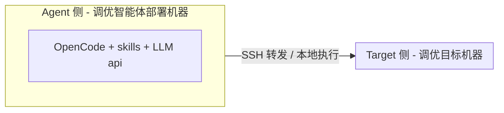
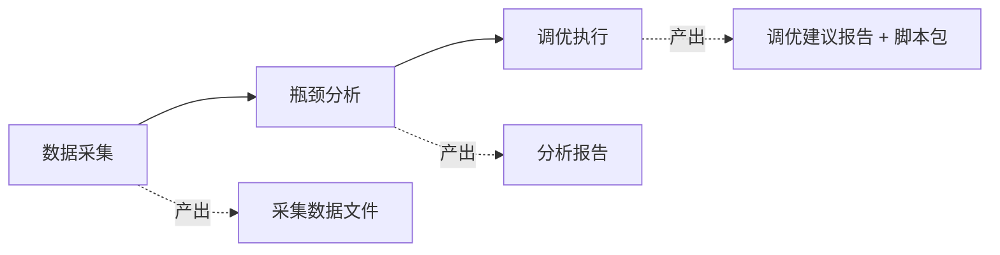

# witty-opentunex 用户指南

## 简介

`witty-opentunex` 是一套面向 Linux 操作系统的智能调优skills工具集。它将 LLM 的推理能力与系统级性能分析相结合，对目标机器进行自顶向下的瓶颈定位与场景化调优，并产出可直接执行的调优建议。

### 项目定位

- **OS 层瓶颈分析**：CPU、内存、IO、网络、调度、锁等多个维度的专项瓶颈识别。
- **场景化调优**：NUMA 调度、窃取任务、动态 SMT、Docker 算力统筹、分域调度、网卡多路径、拷贝优化、BTB分支目标缓冲、hisock网络加速等。
- **可执行调优**：基于瓶颈分析结果生成调优脚本与回滚方案，由用户确认后落地。

### 整体架构



- **Agent 侧**：部署 OpenCode 运行环境与本项目提供的 skills（含元技能、数据采集、瓶颈分析、调优执行、远程执行等），通过 LLM api 完成推理。
- **Target 侧**：被调优的目标 Linux 服务器（全自动化模式下经由 Agent 侧通过 SSH 触达；半自动化模式下用户手动采集后拷贝到 Agent 侧）。
- **约束**：Agent 所在机器需可访问 LLM api；Agent 需能 SSH 连接到 Target（全自动化模式）。

### 三阶段流程

witty-opentunex 严格按"**数据采集 → 瓶颈分析 → 调优执行**"的顺序推进，不可跳跃、不可逆序：



| 阶段 | 入口技能 | 产出 |
|------|---------|------|
| 数据采集 | `opentunex-data-collection` | `${WORK_DIR}/collect/` 下的OS配置及性能数据文件 |
| 瓶颈分析 | `opentunex-bottleneck-analysis` | `${WORK_DIR}/analysis/` 下的通用 + 场景化分析报告 |
| 调优执行 | `opentunex-performance-tuning` | `${WORK_DIR}/tuning/tuning-report.md` 调优报告+ `tuning-package_<时间戳>.tar.gz`调优工具包（包含调优报告和可执行调优脚本） |

元技能 `witty-opentunex` 是上述三阶段的统一编排入口，承担模式判定、目录初始化、阶段切换校验等职责。

### 适用场景

- 数据库、缓存、消息队列等应用在 OS 层出现性能瓶颈，需要快速定位根因并给出有效的调优方案。
- 推理 / 大模型服务在 GPU 资源已饱和后，希望进一步压榨主机端 CPU / 内存 / 网络的性能。
- 容器 / 集群场景下需要做 NUMA、调度、绑核等系统级调优。

---

## 安装

### 目标机（Target）侧依赖

在被调优的目标 Linux 服务器上，需要安装基础的系统性能分析工具。脚本`witty-opentunex`的数据采集环节执行的脚本依赖以下命令：

```sh
yum install -y sysstat util-linux iproute bc numactl ethtool iotop strace perf net-tools
```

| 命令 | 用途 |
|------|------|
| `mpstat` / `iostat` / `vmstat` / `sar` / `pidstat` | 来自 sysstat，CPU / IO / 全局资源指标采集 |
| `perf` | 热点函数、微架构、PMU 等深度分析 |
| `strace` | 系统调用分析 |
| `numactl` | NUMA 拓扑与亲和性 |
| `ethtool` | 网卡队列、IRQ、offload 等 |
| `iotop` | 进程级 IO 监控 |
| `iproute2`（`ip` / `ss`） | 网络协议栈与连接状态 |
| `net-tools`（`netstat`） | 网络统计兼容 |

> 建议以 root 身份运行采集；非 root 时 `perf`、`strace` 等采集项会受限。

### 调优机（Agent）侧安装

Agent 侧需安装 OpenCode + LLM api 接入 + 项目 skills。

#### 步骤 1：安装 OpenCode

配置openEuler-26.09的yum源，使用yum命令安装。

```sh
yum install opencode
```

#### 步骤 2：配置 LLM 提供商

OpenCode 需配置 LLM 提供商。详细方法见：<https://opencode.ai/docs/zh-cn/models/#%E6%8F%90%E4%BE%9B%E5%95%86>

调优 skills 推荐使用 **GLM-4.7** 或 **MiniMax-M2.7** 及以上能力的模型（一般需要上下文长度 > 200K）。

#### 步骤 3：安装调优 skills

配置openEuler-26.09的yum源，使用yum命令安装。

```sh
yum install witty-opentunex
```

安装成功后，`witty-opentunex`的所有skills会安装到opencode的skills配置目录 `~/.opencode/skills/`。

#### 步骤 4：启动 OpenCode

```sh
# 提供一个独立工作空间，可用于存放调优报告
mkdir -p agentspace
cd agentspace/
opencode
```

进入 OpenCode 交互界面后即可开始调优。

---

## 使用方法

### 全自动化模式（推荐）

**适用场景**：调优目标环境可由调优 Agent 部署机器 SSH 连接。

**前置准备**：建立 `调优 Agent 机器` 到 `调优目标机器` 的 SSH 免密连接。若未配置免密，可执行`ssh-keygen -t rsa` + `ssh-copy-id ${user}@${ip}`。

**步骤**：

1. **运行压测负载**：在调优目标环境上跑 benchmark，**建议循环运行**直到分析结束。
2. **启动调优 Agent 会话**：在 OpenCode 中选择 `witty-opentunex` 元技能。
3. **填写任务说明**：参考模板

   1. ```
      ## 任务说明
      当前需要从操作系统层面分析目标环境的性能瓶颈、优化建议，输出一份瓶颈链充分的诊断报告。
      
      ## 采集模式
      - 自动：直接在调优目标环境中自动运行需要的采集命令，目标环境为IP【例如 XX.XX.XX.XX】，用户root。
      
      ## 场景指标
      测试场景为【例如 mysql sysbench】，优化指标为【例如 tps】。
      
      ## 其他说明
      - 压测方式：【例如 wrk -t4 -c200 -d60s / Jmeter 并发 500】（可选输入）
      - 约束限制：【例如 不可调节应用层配置参数、benchmark参数】（可选输入）
      - 异常表现：【例如 p99 延迟从 50ms 剧增到 800ms，CPU 使用率仅 35%】（可选输入）
      ```
4. **等待智能体自动分析**：依次执行数据采集 → 瓶颈分析 → 调优执行；报告最终输出到 `${WORK_DIR}/tuning/tuning-report.md`，并自动将调优报告和调优执行脚本打包为 `tuning-package_<时间戳>.tar.gz`。
5. **人工确认与落地**：智能体在产出调优建议后会等待用户确认，再由用户决定是否执行 `apply`。

### 半自动化模式（手动采集）

**适用场景**：调优目标环境无法 SSH 连接到调优 Agent 部署环境，仅能手动采集数据后传回 Agent 环境分析。

**步骤**：

1. **运行压测负载**：在调优目标环境上跑 benchmark，**建议循环运行**直到分析结束。

2. **数据采集**：两种方式

   1. **方式一**：使用数据采集脚本

      1. 在目标机器上下载数据采集脚本https://gitcode.com/openeuler/witty-opentunex/blob/master/skills/data-collection/opentunex-data-collection/scripts/bottleneck_data_collector.sh
      2. 执行采集脚本

         ```sh
         # 默认方式（不指定 PID）
         bash bottleneck_data_collector.sh -d 60 -o ${WORK_DIR}/collect
         
         # 指定单个活跃 PID（热点 / 系统调用分析必需）
         APP_PID=$(pgrep -a "$APP_NAME" | awk '$2!="Z" {print $1; exit}')
         bash bottleneck_data_collector.sh -d 60 -p "$APP_PID" -o ${WORK_DIR}/collect
         ```

         | 参数        | 说明                                            |
         | ----------- | ----------------------------------------------- |
         | `-d <秒>`   | 采集持续时间                                    |
         | `-p <PID>`  | 监控进程 ID（仅一个活跃 PID，**禁止逗号分隔**） |
         | `-o <目录>` | 输出目录                                        |
         | `-c <项目>` | 采集项，逗号分隔；默认全部                      |
         | `-C`        | 仅前置检查，不执行采集                          |
         | `-h`        | 显示帮助信息                                    |
   2. **方式二**：使用`opentunex-data-collection` skill

      1. 前提条件：目标机器已经安装`witty-opentunex`
      2. 在目标机器启动OpenCode，选择 `opentunex-data-collection`  skill，输入提示词`帮我采集当前系统性能数据`
      3. 等待Agent执行完采集任务后，去输出的目录路径下获取数据文件

3. **传回数据**：把整个数据采集目录拷贝到 Agent 侧。

4. **启动调优 Agent 会话**：在 OpenCode 中选择 `witty-opentunex` 元技能。

5. **填写任务说明**：参考模板

   1. ```
      ## 任务说明
      当前需要从操作系统层面分析目标环境的性能瓶颈、优化建议，输出一份瓶颈链充分的诊断报告。
      
      ## 采集模式
      - 手动：远程调优目标环境无法自动连接，数据需要人工手动采集，当前采集数据已放置在目录【例如 /tmp/opentunex-profiling-XXX】。
      
      ## 场景指标
      测试场景为【例如 mysql sysbench】，优化指标为【例如 tps】。
      
      ## 其他说明
      - 压测方式：【例如 wrk -t4 -c200 -d60s / Jmeter 并发 500】（可选输入）
      - 约束限制：【例如 不可调节应用层配置参数、benchmark参数】（可选输入）
      - 异常表现：【例如 p99 延迟从 50ms 剧增到 800ms，CPU 使用率仅 35%】（可选输入）
      ```

6. **等待分析**：智能体在数据不完整时会给出下一步补采的脚本片段，按提示在目标环境上跑完后传回。

7. **人工确认与落地**：智能体在产出调优建议后会等待用户确认，再由用户决定是否执行 `apply`。

### 产出文件说明

**各阶段产出文件说明：**

| 阶段     | 路径                                                         | 说明                            |
| -------- | ------------------------------------------------------------ | ------------------------------- |
| 数据采集 | `${WORK_DIR}/collect/*.txt`                                  | 13 个数据文件，详情请见下方说明 |
| 瓶颈分析 | `${WORK_DIR}/analysis/<调优方向>`                            | 各方向瓶颈分析报告目录          |
| 瓶颈分析 | `${WORK_DIR}/analysis/opentunex-top-down-bottleneck_collect/result.md` | 通用瓶颈分析报告                |
| 瓶颈分析 | `${WORK_DIR}/analysis/opentunex-scenario-bottleneck_collect/result.md` | 场景化瓶颈分析融合报告          |
| 调优执行 | `${WORK_DIR}/tuning/intermediate/*.md`                       | 各适用方向调优建议报告          |
| 调优执行 | `${WORK_DIR}/tuning/tuning-report.md`                        | 调优建议汇总报告                |
| 调优执行 | `${WORK_DIR}/tuning/<调优方向>/`                             | 各方向调优脚本目录              |
| 调优执行 | `${WORK_DIR}/tuning-package_<YYYYMMDD_HHMMSS>.tar.gz`        | 调优建议与脚本打包              |

**数据采集阶段产出文件说明：**

| 文件                           | 内容                                  |
| ------------------------------ | ------------------------------------- |
| `static_info.txt`              | 硬件规格、OS 版本、内核参数、调度特性 |
| `global_bottleneck.txt`        | CPU / 内存 / IO / 网络全局瓶颈指标    |
| `top_processes.txt`            | 顶级资源消耗进程列表                  |
| `cpu_detail_info.txt`          | CPU 深度信息（/proc/stat 多采样）     |
| `kernel_config_info.txt`       | 内核配置、调度特性、模块              |
| `process_detail_info.txt`      | 进程 / 线程详情、线程生命周期轮询     |
| `container_info.txt`           | 容器资源监控（CPU / 内存 / IO 配额）  |
| `memory_metrics_analysis.txt`  | 内存深度分析（NUMA / 缺页 / Swap）    |
| `network_metrics_analysis.txt` | 网络深度分析（网卡配置 / IRQ / tcp）  |
| `io_metrics_analysis.txt`      | IO 深度分析（调度器 / 队列 / 挂载）   |
| `hotspot_analysis.txt`         | 热点函数分析（perf，需 `-p`）         |
| `syscall_analysis.txt`         | 系统调用分析（strace，需 `-p`）       |
| `pmu_info.txt`                 | PMU 远程访问与 HHA 分析（仅 aarch64） |

### 调优执行

**全自动化模式**和**半自动化模式**都会生成最终的调优报告和调优脚本，参考上述**产出文件说明**。其中`${WORK_DIR}/tuning/`目录结构如下：

```
${WORK_DIR}/tuning/
├── tuning-report.md                       # 最终汇总的调优建议报告
├── intermediate/                          # 各调优技能的中间态建议
│   ├── numa-sched-tuning.md
│   └── ...
├── numa-sched-tuning/                     # 各方向调优脚本目录
│   ├── tuning.sh                          # 入口脚本（动态生成参数，可直接执行）
│   └── numa_sched_tune.sh                 # 基础脚本模板
├── *-tuning/                              # 各方向调优脚本目录
│   ├── ...
```

调优报告`tuning-report.md`包含每个调优方向的瓶颈证据、影响分析、调优手段、调优步骤、回滚方法、调优脚本执行命令等内容。可通过两种方式执行调优：

1. **手动执行**：确定想要执行的调优建议，按照调优报告里对应的步骤执行/回滚。其中每个调优建议对应的调优脚本**check / apply / rollback 三步走**：
   - `check`：检查当前系统状态，确认是否满足调优前置条件，**不做修改**。
   - `apply`：执行调优，落地到系统配置 / 内核参数 / 进程参数。建议先在测试环境验证。
   - `rollback`：回滚到调优前状态。**必须**先在 `check` / `apply` 时记录基线，否则无法可靠回滚。
2. **通过OpenCode执行**：在OpenCode会话里输入提示词，例如`参照调优报告，在目标机器【IP】执行numa-sched的调优/回滚`。

调优执行完成后，可再次运行压测负载，对比调优后的性能数据和基线数据，观察性能是否有优化。

---

## SKILL说明

`witty-opentunex`下的skills主要分为元技能、数据采集、瓶颈分析大类、调优建议生成大类和辅助类技能。

### 元技能

| 技能 | 路径 | 说明 |
|------|------|------|
| `witty-opentunex` | `skills/witty-opentunex/SKILL.md` | 编排"数据采集→瓶颈分析→调优执行"三阶段全流程。包含模式判定、目录初始化、阶段切换校验、产出文件约束。 |

### 数据采集大类

| 技能 | 路径 | 说明 |
|------|------|------|
| `opentunex-data-collection` | `skills/data-collection/opentunex-data-collection/SKILL.md` | 唯一入口：执行 `scripts/bottleneck_data_collector.sh`，产出 13 个数据文件。 |

### 瓶颈分析大类

| 技能 | 路径 | 说明 |
|------|------|------|
| `opentunex-bottleneck-analysis` | `skills/bottleneck/opentunex-bottleneck-analysis/SKILL.md` | 域入口。编排通用分析 + 场景化分析**并行**执行，并融合输出。 |
| `opentunex-top-down-bottleneck` | `skills/bottleneck/opentunex-top-down-bottleneck/SKILL.md` | 自顶向下系统瓶颈分析（七阶段）。所有 OS 层调优任务的首选入口。 |
| `opentunex-sched-bottleneck` | `skills/bottleneck/opentunex-sched-bottleneck/SKILL.md` | 调度延迟、抢占、唤醒延迟、运行队列竞争分析。 |
| `opentunex-lock-bottleneck` | `skills/bottleneck/opentunex-lock-bottleneck/SKILL.md` | 锁竞争、futex 等待、自旋锁、阻塞行为分析。 |
| `opentunex-io-bottleneck` | `skills/bottleneck/opentunex-io-bottleneck/SKILL.md` | 磁盘 IO 利用率、IO 等待、队列深度、内存压力分析。 |
| `opentunex-mem-bottleneck` | `skills/bottleneck/opentunex-mem-bottleneck/SKILL.md` | 内存利用率、Swap、缺页、内存带宽、NUMA / Cluster 访问分析。 |
| `opentunex-net-bottleneck` | `skills/bottleneck/opentunex-net-bottleneck/SKILL.md` | 网络带宽、延迟、丢包、连接状态、协议栈效率分析。 |
| `opentunex-application-bottleneck` | `skills/bottleneck/opentunex-application-bottleneck/SKILL.md` | 应用层深度分析：MySQL、Redis、PostgreSQL、Kafka、Nginx、MongoDB、Java、Go。 |
| `opentunex-scenario-bottleneck` | `skills/bottleneck/opentunex-scenario-bottleneck/SKILL.md` | 场景化瓶颈分析协调器，调度 NUMA / 窃取任务 / 动态 SMT / Docker 算力 / 分域调度 / 网卡多路径 / 拷贝优化 / BTB分支目标缓冲 / hisock网络加速等场景分析。 |

### 调优建议生成大类

| 技能 | 路径 | 说明 |
|------|------|------|
| `opentunex-performance-tuning` | `skills/optimization/opentunex-performance-tuning/SKILL.md` | 域入口。基于融合报告调度各调优技能，汇总为一份完整调优建议报告。 |
| `opentunex-os-performance-optimization` | `skills/optimization/opentunex-os-performance-optimization/SKILL.md` | OS 层调优建议：CPU / 内存 / IO / 网络参数与亲和性。 |
| `opentunex-application-optimization` | `skills/optimization/opentunex-application-optimization/SKILL.md` | 应用层调优建议：MySQL、Redis、PostgreSQL、Kafka、Nginx、MongoDB、Java、Go。 |
| `opentunex-scenario-tuning` | `skills/optimization/opentunex-scenario-tuning/SKILL.md` | 场景化调优协调器：NUMA 调度、窃取任务、Docker 算力统筹、分域调度、动态 SMT、网卡多路径、拷贝优化、BTB分支目标缓冲、hisock网络加速。 |
| `opentunex-inference-core-binding-optimization` | `skills/optimization/opentunex-inference-core-binding-optimization/SKILL.md` | 推理核心绑核优化：消除长尾延迟与抖动。 |

### 辅助技能

| 技能 | 路径 | 说明 |
|------|------|------|
| `opentunex-remote-execution` | `skills/auxiliary/opentunex-remote-execution/SKILL.md` | 远程执行框架：标准化 SSH 连接管理、命令执行模式、超时处理。 |

---

## 注意事项

- 建议以 root 运行采集与调优；非 root 时 perf / strace / 调优脚本会受限。
- 推荐使用 **GLM-4.7** 或 **MiniMax-M2.7** 及以上能力的模型（上下文长度 > 200K）。
- 调优脚本默认不自动执行 `apply`，由用户确认后触发；任何修改内核参数、覆盖配置文件、重启服务的命令都必须先获得用户确认。
- 远端机器的认证信息（密码 / 私钥）**不要**让 LLM 长期持有，建议使用免密 SSH。
