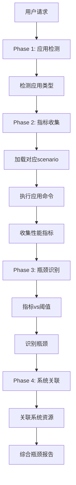
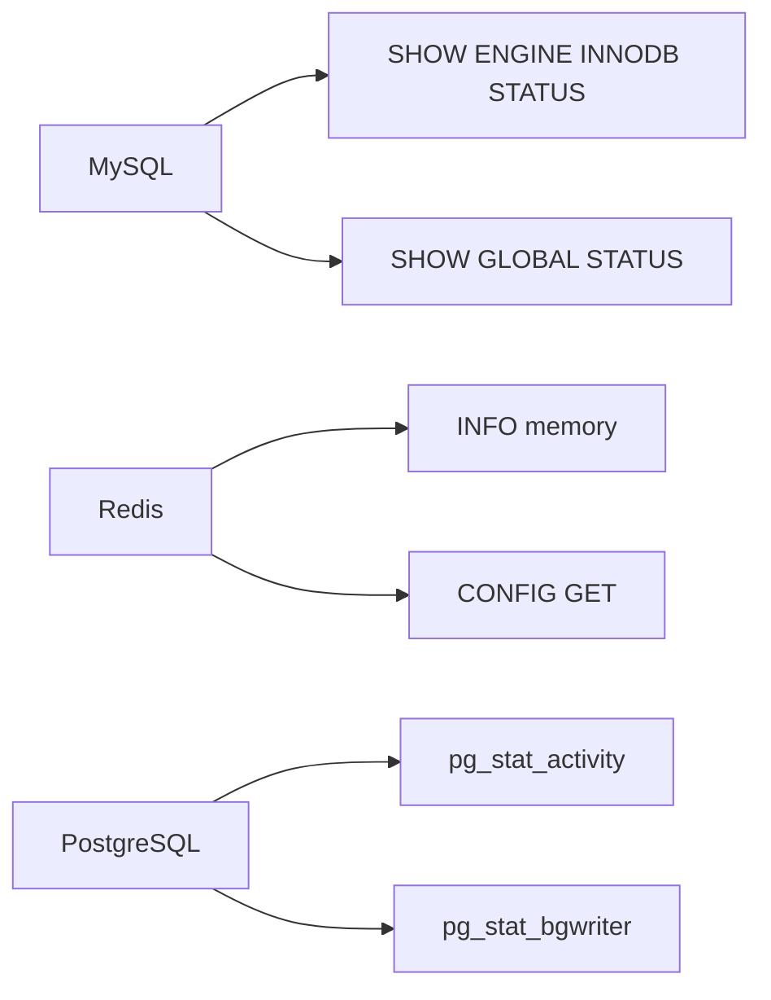

# application-bottleneck 设计文档

## 使用场景

### 典型场景

1. **深度分析** - top-down分析后确认是应用层问题
2. **应用调优前** - 确定应用内部瓶颈
3. **故障诊断** - 应用响应慢但系统资源正常
4. **性能评估** - 应用级健康检查

### 不适用场景

- OS级别问题 - 使用io-bottleneck/mem-bottleneck等
- 未知问题 - 使用top-down-bottleneck先行

## 模块架构

```
application-bottleneck
├── SKILL.md                          # 主Skill文件
└── references/
    └── scenarios/                     # 应用场景库
        ├── mysql.md                   # MySQL分析
        ├── redis.md                   # Redis分析
        ├── postgres.md                # PostgreSQL分析
        ├── kafka.md                   # Kafka分析
        ├── nginx.md                   # Nginx分析
        ├── mongodb.md                # MongoDB分析
        ├── java.md                   # Java分析
        └── golang.md                 # Go分析
```

## 工作流图 (4+1视图)

### 1. 场景视图

```
┌─────────────────┐
│ top-down分析   │
│ 确认应用层问题 │
└────────┬────────┘
         │
         ▼
┌─────────────────────────────────────┐
│       application-bottleneck          │
│                                        │
│  Phase 1: 检测应用                     │
│  Phase 2: 收集指标 (调用scenario)    │
│  Phase 3: 识别瓶颈                   │
│  Phase 4: 系统关联                    │
└────────┬────────────────────────────┘
         │
         ▼
┌─────────────────────────────────────┐
│       输出: 应用瓶颈报告               │
│  - 指标列表                          │
│  - 瓶颈清单                          │
│  - 优化建议                          │
└─────────────────────────────────────┘
```

### 2. 活动视图

```
┌─────────────────────────────────────────────────────────────┐
│                  Phase 1: 应用检测                           │
├─────────────────────────────────────────────────────────────┤
│  ps aux | grep mysqld|redis|postgres|kafka|mongo|java    │
│  ss -tlnp | grep 3306|6379|5432|9092|27017|8080        │
└─────────────────────────────────────────────────────────────┘
                            │
                            ▼
┌─────────────────────────────────────────────────────────────┐
│                  Phase 2: 指标收集                           │
├─────────────────────────────────────────────────────────────┤
│  根据应用类型加载对应scenario:                              │
│                                                              │
│  MySQL:     SHOW ENGINE INNODB STATUS                      │
│             SHOW GLOBAL STATUS                               │
│             SHOW PROCESSLIST                                │
│                                                              │
│  Redis:     INFO memory                                    │
│             INFO stats                                      │
│             CONFIG GET *                                     │
│                                                              │
│  PostgreSQL: SELECT * FROM pg_stat_activity                 │
│              SELECT * FROM pg_stat_bgwriter                  │
└─────────────────────────────────────────────────────────────┘
                            │
                            ▼
┌─────────────────────────────────────────────────────────────┐
│                  Phase 3: 瓶颈识别                           │
├─────────────────────────────────────────────────────────────┤
│  指标 vs 阈值:                                              │
│                                                              │
│  缓冲池命中率 < 95% → 缓冲池瓶颈                          │
│  连接使用率 > 70% → 连接瓶颈                               │
│  锁等待 > 1s → 锁瓶颈                                     │
│  慢查询 > 50/s → 查询瓶颈                                  │
└─────────────────────────────────────────────────────────────┘
                            │
                            ▼
┌─────────────────────────────────────────────────────────────┐
│                  Phase 4: 系统关联                           │
├─────────────────────────────────────────────────────────────┤
│  应用瓶颈 → 系统资源:                                       │
│                                                              │
│  缓冲池小 → 磁盘IO高, iowait高                            │
│  连接瓶颈 → CPU高, 进程数多                                │
│  锁瓶颈 → 调度延迟, cs高                                  │
└─────────────────────────────────────────────────────────────┘
```

## 流程图 (Mermaid)

### 主流程图



### 指标收集流程



## 核心业务流程

### 指标收集模式

```bash
collect_mysql_metrics() {
    mysql -e "SHOW ENGINE INNODB STATUS\G" > /tmp/mysql_innodb.txt
    mysql -e "SHOW GLOBAL STATUS LIKE 'Com_%'\G" > /tmp/mysql_status.txt
    mysql -e "SHOW GLOBAL VARIABLES\G" > /tmp/mysql_vars.txt
    mysql -e "SHOW PROCESSLIST\G" > /tmp/mysql_processlist.txt
}

collect_redis_metrics() {
    redis-cli INFO > /tmp/redis_info.txt
    redis-cli CONFIG GET * > /tmp/redis_config.txt
    redis-cli SLOWLOG GET 10 > /tmp/redis_slowlog.txt
}
```

### 瓶颈判定规则

```bash
# MySQL瓶颈规则
IF innodb_buffer_pool_reads > innodb_buffer_pool_read_requests * 0.3:
    瓶颈 = "缓冲池过小"
    严重程度 = "高"

IF Threads_connected > max_connections * 0.7:
    瓶颈 = "连接数接近上限"
    严重程度 = "中"

IF Table_locks_waited > Table_locks_immediate * 0.1:
    瓶颈 = "表锁竞争"
    严重程度 = "中"
```

## 异常情形处理

| 异常 | 处理 |
|------|------|
| 应用无响应 | 报告连接失败，跳过该应用 |
| 权限不足 | 报告需要的权限 |
| 指标收集超时 | 部分收集，标记超时项 |
| 解析失败 | 输出原始数据，标记失败 |
