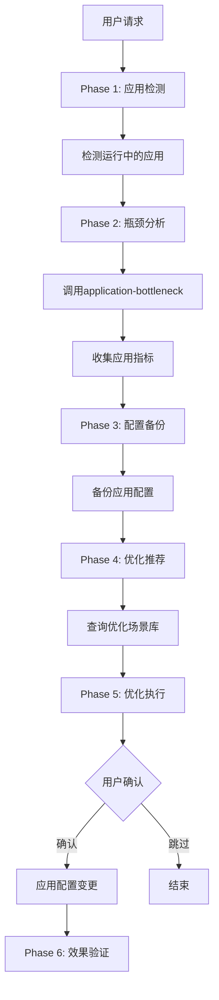
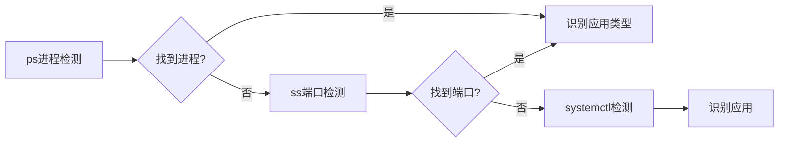
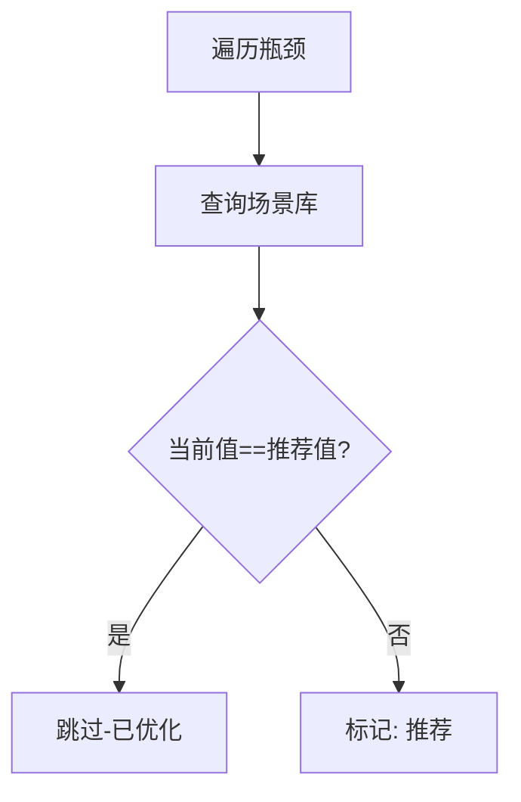

# application-optimization 设计文档

## 使用场景

### 典型场景

1. **应用性能调优** - MySQL/Redis等应用响应慢时的配置优化
2. **上线前优化** - 新系统上线前的应用级配置优化
3. **瓶颈定位后** - top-down分析后确认是应用层问题
4. **定期维护** - 应用配置周期性优化

### 不适用场景

- OS级别问题 - 使用os-performance-optimization
- 未知瓶颈 - 使用top-down-bottleneck先行分析
- SQL查询优化 - 需要DBA人工分析执行计划

## 模块架构

```
application-optimization
├── SKILL.md                          # 主Skill文件 (Phase 1-7)
└── references/
    └── scenarios/                     # 应用优化场景库
        ├── mysql.md                   # MySQL优化策略
        ├── redis.md                   # Redis优化策略
        ├── postgres.md                # PostgreSQL优化策略
        ├── nginx.md                   # Nginx优化策略
        ├── kafka.md                   # Kafka优化策略
        ├── mongodb.md                # MongoDB优化策略
        ├── java.md                   # Java/JVM优化策略
        └── golang.md                 # Go优化策略
```

## 工作流图 (4+1视图)

### 1. 场景视图

```
┌─────────────────┐
│ 应用检测        │
│ (ps/ss/socket) │
└────────┬────────┘
         │
         ▼
┌─────────────────────────────────────┐
│      application-optimization         │
│                                      │
│  Phase 1: 应用检测                   │
│  Phase 2: 瓶颈分析 (调用bottleneck)  │
│  Phase 3: 配置备份                   │
│  Phase 4: 优化推荐                   │
│  Phase 5: 优化执行                   │
│  Phase 6: 效果验证                   │
└────────┬────────────────────────────┘
         │
    ┌────┴────┐
    ▼         ▼
┌───────┐ ┌───────┐
│ 成功  │ │ 回滚  │
└───────┘ └───────┘
```

### 2. 活动视图

```
┌─────────────────────────────────────────────────────────────┐
│                  Phase 1: 应用检测                           │
├─────────────────────────────────────────────────────────────┤
│  ps aux | grep mysqld|redis|postgres|nginx|kafka|mongo      │
│  ss -tlnp | grep 3306|6379|5432|80|9092|27017             │
│  systemctl list-units --type=service --state=running       │
└─────────────────────────────────────────────────────────────┘
                            │
                            ▼
┌─────────────────────────────────────────────────────────────┐
│                  Phase 2: 瓶颈分析                           │
├─────────────────────────────────────────────────────────────┤
│  调用 application-bottleneck skill                           │
│                                                              │
│  ├→ MySQL: SHOW ENGINE INNODB STATUS, SHOW PROCESSLIST       │
│  ├→ Redis: INFO, CONFIG GET *                              │
│  ├→ PostgreSQL: pg_stat_activity, pg_stat_bgwriter         │
│  └→ Nginx: stub_status, upstream_status                     │
└─────────────────────────────────────────────────────────────┘
                            │
                            ▼
┌─────────────────────────────────────────────────────────────┐
│                  Phase 3: 配置备份                           │
├─────────────────────────────────────────────────────────────┤
│  应用配置备份到: /opt/opentunex/backup/app/                 │
│                                                              │
│  MySQL: my.cnf → my.cnf.backup                            │
│  Redis: redis.conf → redis.conf.backup                      │
│  Nginx: nginx.conf → nginx.conf.backup                      │
└─────────────────────────────────────────────────────────────┘
                            │
                            ▼
┌─────────────────────────────────────────────────────────────┐
│                  Phase 4: 优化推荐                           │
├─────────────────────────────────────────────────────────────┤
│  根据瓶颈查询 scenarios/ 优化库                             │
│                                                              │
│  瓶颈A → [OPT-1, OPT-2]                                    │
│  瓶颈B → [OPT-3]                                           │
└─────────────────────────────────────────────────────────────┘
                            │
                            ▼
┌─────────────────────────────────────────────────────────────┐
│                  Phase 5: 优化执行                           │
├─────────────────────────────────────────────────────────────┤
│  用户确认后执行:                                             │
│                                                              │
│  1. 写入新配置到临时文件                                    │
│  2. 合并到原配置文件                                        │
│  3. systemctl restart <app>                                 │
│  4. 验证服务状态                                            │
└─────────────────────────────────────────────────────────────┘
                            │
                            ▼
┌─────────────────────────────────────────────────────────────┐
│                  Phase 6: 效果验证                           │
├─────────────────────────────────────────────────────────────┤
│  benchmark-execution skill 执行基准测试                       │
│                                                              │
│  MySQL: mysqlslap                                           │
│  Redis: redis-benchmark                                     │
│  Nginx: ab/wrk                                              │
└─────────────────────────────────────────────────────────────┘
```

### 3. 交互视图

```
用户                    Skill                   Remote Server
  │                      │                          │
  │ 优化MySQL           │                          │
  │────────────────────▶│                          │
  │                      │                          │
  │                      │ Phase 1: 检测           │
  │                      │ ps aux | grep mysql     │
  │                      │─────────────────────────▶│
  │                      │◀─────────────────────────│
  │                      │   MySQL运行中           │
  │                      │                          │
  │                      │ Phase 2: 瓶颈分析       │
  │                      │ 调用 bottleneck skill    │
  │                      │                          │
  │                      │ Phase 3: 配置备份       │
  │                      │ cp /etc/mysql/my.cnf    │
  │                      │─────────────────────────▶│
  │                      │                          │
  │                      │ Phase 4: 推荐           │
  │◀─────────────────────│ 缓冲池太小...         │
  │                      │                          │
  │ 确认优化            │                          │
  │────────────────────▶│                          │
  │                      │                          │
  │                      │ Phase 5: 执行          │
  │                      │ vi /etc/mysql/my.cnf   │
  │                      │ systemctl restart mysql │
  │                      │─────────────────────────▶│
  │                      │                          │
  │                      │ Phase 6: 验证          │
  │                      │ mysqlslap benchmark    │
  │                      │─────────────────────────▶│
  │                      │                          │
  │◀─────────────────────│ QPS: 5000 → 8500     │
```

### 4. 部署视图

```
┌──────────────────────────────────────────────────────────────┐
│                        本地机器                              │
│  ┌────────────────────────────────────────────────────┐   │
│  │ application-optimization skill                        │   │
│  │  └──────┬──────────┘                               │   │
│  │         │                                          │   │
│  │  ┌──────▼──────┐    ┌─────────────────────────┐  │   │
│  │  │ application- │    │ benchmark-execution    │  │   │
│  │  │ bottleneck  │    │ skill                  │  │   │
│  │  └─────────────┘    └─────────────────────────┘  │   │
│  └────────────────────────────────────────────────────┘   │
└─────────────────────────────────────────────────────────────┘
                              │ SSH
                              ▼
┌──────────────────────────────────────────────────────────────┐
│                     目标服务器                               │
│  ┌────────────────────────────────────────────────────┐   │
│  │ /opt/opentunex/backup/app/YYYYMMDD_HHMMSS/          │   │
│  │   - my.cnf.backup                                    │   │
│  │   - redis.conf.backup                               │   │
│  └────────────────────────────────────────────────────┘   │
│  ┌────────────────────────────────────────────────────┐   │
│  │ /etc/mysql/my.cnf (已优化)                           │   │
│  │ /etc/redis/redis.conf (已优化)                     │   │
│  │ /etc/nginx/nginx.conf (已优化)                      │   │
│  └────────────────────────────────────────────────────┘   │
└──────────────────────────────────────────────────────────────┘

## 流程图 (Mermaid)

### 主流程图



### 应用检测流程



### 优化推荐流程



## 核心业务流程

### 应用检测算法

```bash
# 检测优先级: 进程检测 > 端口检测 > 服务检测

# 1. 进程检测
ps aux | grep -E "mysqld|redis-server|postgres|nginx|kafka|mongod|java|go"

# 2. 端口检测
ss -tlnp | grep -E ":3306|:6379|:5432|:80|:9092|:27017"

# 3. 服务状态
systemctl is-active mysql redis nginx postgresql
```

### 优化推荐算法

```bash
For each 瓶颈 in 瓶颈列表:
    场景文件 = lookup(瓶颈类别)
    
    优化项 = 场景文件.查询(瓶颈指标)
    
    For each 优化 in 优化项:
        IF 当前值 == 推荐值:
            标记: 跳过(已优化)
        ELSE:
            标记: 推荐
```

## 异常情形处理

| 异常 | 处理 |
|------|------|
| 应用未运行 | 报告并询问是否启动 |
| 配置文件无写权限 | 报告权限问题，建议sudo |
| 服务重启失败 | 回滚配置，重启服务 |
| 基准测试失败 | 跳过测试，记录错误 |
| 应用崩溃 | 自动回滚，报告问题 |
