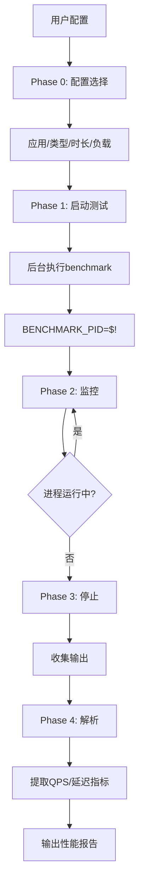
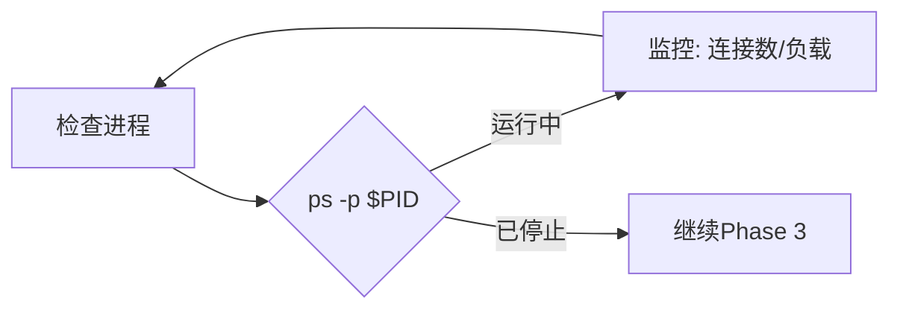
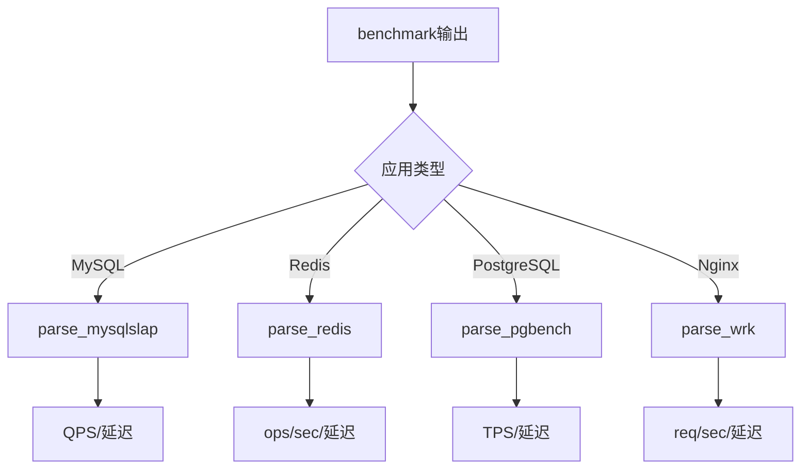

# benchmark-execution 设计文档

## 使用场景

### 典型场景

1. **性能验证** - OS/应用优化后的效果验证
2. **基线建立** - 建立性能基线用于对比
3. **容量规划** - 确定系统最大承载能力
4. **回归测试** - 变更前后性能对比

### 不适用场景

- 未知瓶颈诊断 - 使用top-down-bottleneck
- 实时监控 - 使用系统监控工具

## 模块架构

```
benchmark-execution
├── SKILL.md                          # 主Skill文件
└── references/                       # 工具参考
    ├── mysql.md                     # mysqlslap详解
    ├── redis.md                    # redis-benchmark详解
    ├── postgres.md                  # pgbench详解
    ├── nginx.md                     # ab/wrk/wrk2详解
    ├── java.md                     # JMeter/Gatling详解
    └── go.md                       # go test详解
```

## 工作流图 (4+1视图)

### 1. 场景视图

```
┌─────────────────┐
│ 测试配置        │
│ (应用/类型/时长)│
└────────┬────────┘
         │
         ▼
┌─────────────────────────────────────┐
│         benchmark-execution          │
│                                      │
│  Phase 0: 配置                       │
│  Phase 1: 启动 (后台)                │
│  Phase 2: 监控                      │
│  Phase 3: 停止                      │
│  Phase 4: 解析                      │
└────────┬────────────────────────────┘
         │
         ▼
┌─────────────────────────────────────┐
│         输出: 性能指标报告             │
│  - QPS/TPS/ops/sec                │
│  - 延迟分布 (p50/p95/p99)          │
│  - 吞吐量                          │
└─────────────────────────────────────┘
```

### 2. 活动视图

```
┌─────────────────────────────────────────────────────────────┐
│                  Phase 0: 配置                               │
├─────────────────────────────────────────────────────────────┤
│  用户选择:                                                    │
│  1. 应用: MySQL/Redis/PostgreSQL/Nginx/Java/Go             │
│  2. 类型: 内置/自定义脚本/生产负载                          │
│  3. 时长: 30s / 60s / 120s / 自定义                      │
│  4. 负载: 低 / 中 / 高                                     │
└─────────────────────────────────────────────────────────────┘
                            │
                            ▼
┌─────────────────────────────────────────────────────────────┐
│                  Phase 1: 启动测试                           │
├─────────────────────────────────────────────────────────────┤
│  benchmark_command &                                       │
│  PID=$!                                                    │
│  echo "PID: $PID"                                         │
└─────────────────────────────────────────────────────────────┘
                            │
                            ▼
┌─────────────────────────────────────────────────────────────┐
│                  Phase 2: 监控                              │
├─────────────────────────────────────────────────────────────┤
│  while ps -p $PID > /dev/null; do                        │
│      # 检查进程状态                                         │
│      # 检查连接数 (netstat)                                 │
│      # 检查系统负载 (top)                                   │
│      sleep 5                                              │
│  done                                                     │
└─────────────────────────────────────────────────────────────┘
                            │
                            ▼
┌─────────────────────────────────────────────────────────────┐
│                  Phase 3: 停止 & 收集                      │
├─────────────────────────────────────────────────────────────┤
│  kill $PID                                                 │
│  wait $PID                                                 │
│  cp /tmp/benchmark_output.log $BENCHMARK_DIR/            │
└─────────────────────────────────────────────────────────────┘
                            │
                            ▼
┌─────────────────────────────────────────────────────────────┐
│                  Phase 4: 解析                             │
├─────────────────────────────────────────────────────────────┤
│  parse_mysqlslap_output()  # references/mysql.md       │
│  parse_redis_output()     # references/redis.md         │
│  parse_pgbench_output()    # references/postgres.md      │
│  parse_wrk_output()        # references/nginx.md          │
└─────────────────────────────────────────────────────────────┘
```

### 3. 交互视图

```
用户                    Skill                   Remote Server
  │                      │                          │
  │ 配置测试            │                          │
  │────────────────────▶│                          │
  │                      │                          │
  │                      │ Phase 1: 启动           │
  │                      │ mysqlslap ... &         │
  │                      │────────────────────────▶│
  │                      │                          │
  │                      │ Phase 2: 监控           │
  │                      │ ps -p $PID              │
  │                      │ netstat | grep EST      │
  │                      │◀────────────────────────│
  │                      │   (循环监控中)          │
  │                      │                          │
  │                      │ Phase 3: 完成           │
  │                      │ kill $PID               │
  │                      │────────────────────────▶│
  │                      │                          │
  │                      │ Phase 4: 解析           │
  │                      │ parse_mysqlslap_output()│
  │                      │                          │
    │◀─────────────────────│ QPS: 2456.78          │
    │                      │ Latency: 20.35ms       │
```

## 流程图 (Mermaid)

### 主流程图



### 测试监控循环



### 输出解析流程



## 核心业务流程

### 测试启动流程

```bash
# 1. 构建命令
CMD="mysqlslap --host=localhost --concurrency=50 --iterations=100 ..."

# 2. 后台启动
$CMD > /tmp/benchmark_output.log 2>&1 &
BENCHMARK_PID=$!

# 3. 保存PID
echo $BENCHMARK_PID > /tmp/benchmark.pid
```

### 输出解析流程

```bash
case "$APP_TYPE" in
    mysql)
        # 解析mysqlslap输出
        QPS=$(grep "queries per second" /tmp/benchmark_output.log | awk '{print $NF}')
        AVG=$(grep "Average number of seconds" /tmp/benchmark_output.log | awk '{print $NF}')
        ;;
    redis)
        # 解析redis-benchmark输出
        RPS=$(grep "requests per second" /tmp/benchmark_output.log | awk '{print $NF}')
        ;;
    postgres)
        # 解析pgbench输出
        TPS=$(grep "^tps =" /tmp/benchmark_output.log | awk '{print $3}')
        ;;
esac
```

## 异常情形处理

| 异常 | 处理 |
|------|------|
| 工具未安装 | 报告并提示安装方法 |
| 连接失败 | 检查服务状态/端口 |
| 测试超时 | kill进程，报告超时 |
| 进程异常退出 | 收集已输出日志，分析原因 |
| 解析失败 | 输出原始日志，标记解析失败 |
