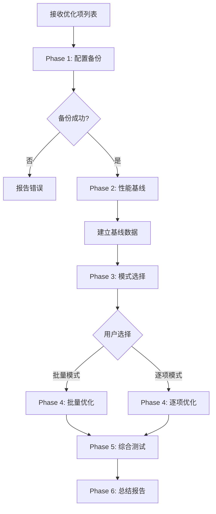
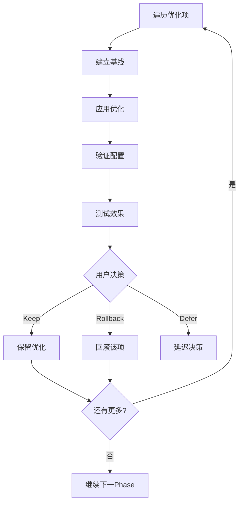

# os-optimization-enablement 设计文档

## 使用场景

### 典型场景

1. **优化实施** - os-performance-optimization分析后的实际优化执行
2. **配置变更** - 批量修改系统参数（swappiness、io调度器等）
3. **效果验证** - 变更后通过基准测试验证效果
4. **安全回滚** - 变更出问题时的快速回滚

### 不适用场景

- 仅需要分析不需要实施 - 使用os-performance-optimization
- 应用层配置变更 - 使用application-optimization
- 未知问题诊断 - 使用top-down-bottleneck

## 模块架构

```
os-optimization-enablement
├── SKILL.md                          # 主Skill文件 (Phase 1-6)
└── scripts/
    └── backup_config.sh               # 配置备份脚本(远程执行)
```

### 模块职责

| 模块 | 职责 |
|------|------|
| SKILL.md | 6个Phase的完整流程控制 |
| backup_config.sh | 远程执行配置备份 |

## 代码架构

### Phase流程

```
Phase 1: 配置备份
    ├→ 识别需备份的配置
    ├→ 执行backup_config.sh
    └→ 验证备份完成

Phase 2: 性能基线测试
    ├→ 用户选择基准测试方法
    ├→ 执行基准测试
    └→ 保存基线数据

Phase 3: 执行模式选择
    ├→ 用户选择模式 (Batch/Step-by-Step)
    └→ 跳转对应Phase

Phase 4: 优化执行 (Batch模式)
    ├→ 创建优化脚本
    ├→ 远程执行
    ├→ 验证应用结果
    └→ 跳转Phase 5

Phase 4: 优化执行 (Step-by-Step模式)
    For each 优化项:
        ├→ 预检查基准
        ├→ 应用单项优化
        ├→ 验证+测试
        └→ 用户决定: Keep/Rollback

Phase 5: 综合测试
    ├→ 用户选择测试方法
    ├→ 执行测试
    └→ 对比基线

Phase 6: 总结报告
    ├→ 生成优化汇总表
    ├→ 生成回滚脚本
    └→ 输出最终建议
```

## 工作流图 (4+1视图)

### 1. 场景视图

```
┌─────────────────┐
│ 优化项列表      │
│ (来自OS-Perf-Opt)│
└────────┬────────┘
         │
         ▼
┌─────────────────────────────────────┐
│    os-optimization-enablement       │
│                                     │
│  Phase 1: 配置备份                  │
│  Phase 2: 性能基线                  │
│  Phase 3: 模式选择                  │
│  Phase 4: 执行优化                  │
│  Phase 5: 综合测试                  │
│  Phase 6: 总结报告                  │
└────────┬────────────────────────────┘
         │
    ┌────┴────┐
    ▼         ▼
┌───────┐ ┌───────┐
│ 成功  │ │ 回滚  │
│ 完成  │ │ 脚本  │
└───────┘ └───────┘
```

### 2. 活动视图 (Batch模式)

```
┌─────────────────────────────────────────────────────────────┐
│                    Phase 4: 批量优化                         │
├─────────────────────────────────────────────────────────────┤
│                                                              │
│  ┌─────────────────────────────────────────────────┐        │
│  │ 1. 创建优化脚本 batch_optimization.sh          │        │
│  └───────────────────────┬─────────────────────────┘        │
│                          │                                  │
│                          ▼                                  │
│  ┌─────────────────────────────────────────────────┐        │
│  │ 2. 远程执行: ssh ... bash -s < batch.sh    │        │
│  └───────────────────────┬─────────────────────────┘        │
│                          │                                  │
│                          ▼                                  │
│  ┌─────────────────────────────────────────────────┐        │
│  │ 3. 验证: 检查sysctl/io_scheduler值             │        │
│  └───────────────────────┬─────────────────────────┘        │
│                          │                                  │
│                          ▼                                  │
│  ┌─────────────────────────────────────────────────┐        │
│  │ 4. 创建永久配置 /etc/sysctl.d/99-optimization  │        │
│  └───────────────────────┬─────────────────────────┘        │
│                          │                                  │
│                          ▼                                  │
│  ┌─────────────────────────────────────────────────┐        │
│  │ 5. 加载配置: sysctl -p                          │        │
│  └─────────────────────────────────────────────────┘        │
│                                                              │
└─────────────────────────────────────────────────────────────┘
```

### 3. 活动视图 (Step-by-Step模式)

```
┌─────────────────────────────────────────────────────────────┐
│                  Phase 4: 逐项优化                          │
├─────────────────────────────────────────────────────────────┤
│                                                              │
│  Loop for each 优化项 in 优化列表:                         │
│                                                              │
│  ┌─────────────────────────────────────────────────┐        │
│  │ OPT-X: [优化名称]                                 │        │
│  │                                                  │        │
│  │ Step 1: 预优化基准测试                           │        │
│  │         ↓                                        │        │
│  │ Step 2: 应用优化                                 │        │
│  │         ↓                                        │        │
│  │ Step 3: 验证配置                                 │        │
│  │         ↓                                        │        │
│  │ Step4: 优化后测试                                │        │
│  │         ↓                                        │        │
│  │ ┌─────────────────────────────────────────┐    │        │
│  │ │ 用户决策:                                │    │        │
│  │ │ ○ Keep  ○ Rollback  ○ Defer            │    │        │
│  │ └─────────────────────────────────────────┘    │        │
│  └─────────────────────────────────────────────────┘        │
│                                                              │
│  Progress: [■■■■■□□□□□] 5/10                               │
│                                                              │
└─────────────────────────────────────────────────────────────┘
```

### 4. 交互视图

```
用户              Skill                 Remote Server
  │                │                        │
  │ 执行优化      │                        │
  │──────────────▶│                        │
  │                │                        │
  │                │ Phase 1: 备份         │
  │                │───────────────────────▶│
  │                │   backup_config.sh     │
  │                │◀──────────────────────│
  │                │   备份完成            │
  │                │                        │
  │                │ Phase 2: 基线测试     │
  │                │───────────────────────▶│
  │                │   sysbench/fio         │
  │                │◀──────────────────────│
  │                │   基线数据             │
  │                │                        │
  │◀───────────────│ 基线报告              │
  │                │                        │
  │ 选择执行模式   │                        │
  │──────────────▶│                        │
  │                │                        │
  │                │ Phase 4: 执行优化     │
  │                │───────────────────────▶│
  │                │   sysctl/调度器变更   │
  │                │◀──────────────────────│
  │                │   验证结果            │
  │                │                        │
  │                │ Phase 5: 综合测试     │
  │                │───────────────────────▶│
  │                │   测试结果             │
  │                │◀──────────────────────│
  │                │                        │
  │◀───────────────│ Phase 6: 总结报告    │
  │                │                        │
```

### 5. 部署视图

```
┌──────────────────────────────────────────────────────────────┐
│                        本地机器                              │
│  ┌──────────────────────────────────────────────────────┐   │
│  │ OpenCode Agent                                      │   │
│  │  ┌──────────────────────┐                           │   │
│  │  │ os-optimization-     │                           │   │
│  │  │ enablement skill    │                           │   │
│  │  └──────────┬──────────┘                           │   │
│  │             │                                       │   │
│  │  ┌──────────▼──────────┐                           │   │
│  │  │ remote-execution    │                           │   │
│  │  │ skill              │                           │   │
│  │  └──────────────────────┘                           │   │
│  └──────────────────────┬──────────────────────────────┘   │
└────────────────────────│SSH│──────────────────────────────┘
                           │
                           │ SSH
                           ▼
┌──────────────────────────────────────────────────────────────┐
│                     目标服务器                               │
│  ┌──────────────────────────────────────────────────────┐   │
│  │ /opt/opentunex/backup/YYYYMMDD_HHMMSS/               │   │
│  │   - sysctl_current.txt (备份)                        │   │
│  │   - rollback.sh (回滚脚本)                          │   │
│  └──────────────────────────────────────────────────────┘   │
│  ┌──────────────────────────────────────────────────────┐   │
│  │ /etc/sysctl.d/99-optimization.conf                   │   │
│  │   (永久优化配置)                                    │   │
│  └──────────────────────────────────────────────────────┘   │
│  ┌──────────────────────────────────────────────────────┐   │
│  │ /opt/optimization-results/baseline_*/                │   │
│  │   (基线和测试结果)                                  │   │
│  └──────────────────────────────────────────────────────┘   │
└──────────────────────────────────────────────────────────────┘

## 流程图 (Mermaid)

### 主流程图



### Phase 4 Batch模式


### Phase 4 Step-by-Step模式



## 核心业务流程

### 备份策略

```bash
# backup_config.sh 执行内容
BACKUP_DIR="/opt/opentunex/backup/$(date +%Y%m%d_%H%M%S)"

# 1. 创建目录
mkdir -p $BACKUP_DIR

# 2. 备份sysctl配置
sysctl -a > $BACKUP_DIR/sysctl_current.txt
cp /etc/sysctl.conf $BACKUP_DIR/
cp /etc/sysctl.d/*.conf $BACKUP_DIR/

# 3. 备份VM参数
cat /proc/cmdline > $BACKUP_DIR/cmdline.txt
cat /proc/sys/vm/* > $BACKUP_DIR/vm_params.txt

# 4. 备份IO调度器
for dev in /sys/block/*/queue/scheduler; do
    dev_name=$(basename $(dirname $dev))
    cat $dev > $BACKUP_DIR/scheduler_${dev_name}.txt
done
```

### 回滚策略

```bash
# rollback.sh 内容
#!/bin/bash
cp sysctl.conf.backup /etc/sysctl.conf
rm /etc/sysctl.d/99-optimization.conf
sysctl -p /etc/sysctl.conf

# 恢复IO调度器
for dev in /sys/block/sd*; do
    echo deadline > $dev/queue/scheduler
done
```

## 异常情形处理

| 异常 | 场景 | 处理方式 |
|------|------|----------|
| 备份失败 | 目录创建失败/权限不足 | 终止，提示权限问题 |
| 备份不完整 | 部分文件备份失败 | 警告，继续但不执行优化 |
| 优化应用失败 | sysctl执行失败 | 回滚已应用的变更 |
| 服务中断 | 优化导致服务异常 | 自动/手动回滚 |
| 测试超时 | 基准测试无响应 | 超时终止，报告问题 |
| 用户取消 | 优化过程中用户中断 | 保存当前进度，生成回滚脚本 |
| SSH断开 | 执行中断 | 保存进度，重连后可继续 |

### 回滚触发条件

- 用户手动选择回滚
- 优化后测试显示性能下降 > 10%
- 优化应用后系统不稳定
- 服务响应超时

### 回滚决策流程

```
性能下降?
    │
    ├── > 10% ────▶ 自动建议回滚
    │
    ├── 5-10% ────▶ 用户决策
    │
    └── < 5% ────▶ 保留
```
