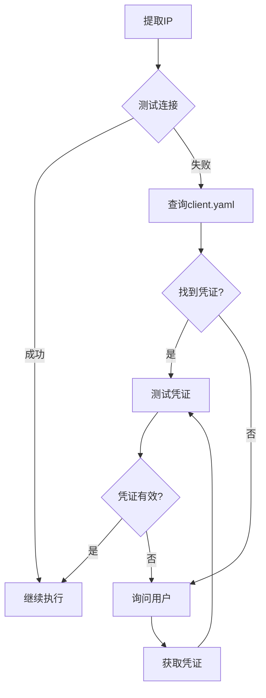
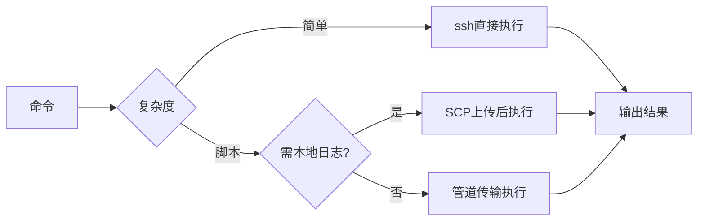

# remote-execution 设计文档

## 使用场景

### 典型场景

1. **所有远程Skill的基础** - 被所有其他Skill引用
2. **批量命令执行** - 多台机器并行执行
3. **脚本上传执行** - 复杂脚本远程运行
4. **perf数据收集** - 需要tty的perf命令

## 模块架构

```
remote-execution
├── SKILL.md                    # 主Skill文件
└── 连接管理/
    ├── SSH连接
    ├── 认证处理
    └── 命令执行
```

## 连接管理流程

```
用户输入(含IP)
    │
    ▼
┌─────────────────┐
│ 提取客户端IP    │
│ from context    │
└────────┬────────┘
         │
         ▼
┌─────────────────┐
│ 测试SSH连接     │
└────────┬────────┘
         │
    ┌────┴────┐
    │ 成功?    │
    ├─ YES ──→ 继续
    │
    └─ NO ──→ 查询client.yaml
              │
              ▼
         ┌─────────────────┐
         │ 找到凭证?       │
         ├─ YES ──→ 测试连接
         │                 │
         └─ NO ──→ 询问用户
```

## 命令执行模式

### 模式1: 简单命令

```bash
ssh ${username}@${ip} "command"
```

适用: 单条命令，输出较小

### 模式2: 管道传输

```bash
ssh ${username}@${ip} "bash -s" < script.sh
```

适用: 脚本无需本地保留

### 模式3: SCP后执行

```bash
scp script.sh ${username}@${ip}:/tmp/
ssh ${username}@${ip} "sh /tmp/script.sh"
```

适用: 需要本地日志、perf数据存本地

### 模式4: perf命令 (强制-tty)

```bash
ssh -q -tt ${username}@${ip} 'perf sched record -a -- sleep 15'
```

适用: perf需要tty环境

## 安全设计

### 破坏性命令确认

```bash
if [[ "$CMD" =~ "rm|shutdown|reboot|init" ]]; then
    echo "DESTRUCTIVE COMMAND DETECTED"
    echo "请确认是否继续: $CMD"
    read CONFIRM
    if [ "$CONFIRM" != "yes" ]; then
        exit 1
    fi
fi
```

### 数据本地性

```bash
# WRONG: 禁止
scp ${username}@${ip}:/var/log/app.log .

# RIGHT: 远程分析
ssh ${username}@${ip} "grep error /var/log/app.log"
```

## 流程图 (Mermaid)

### SSH连接流程



### 命令执行流程



## 异常处理

| 异常 | 处理 |
|------|------|
| SSH超时 | 重试3次，报告失败 |
| 连接拒绝 | 检查服务状态 |
| 认证失败 | 重新获取凭证 |
| 命令超时 | 增加timeout或终止 |
| tty错误 | 使用-t强制分配 |
