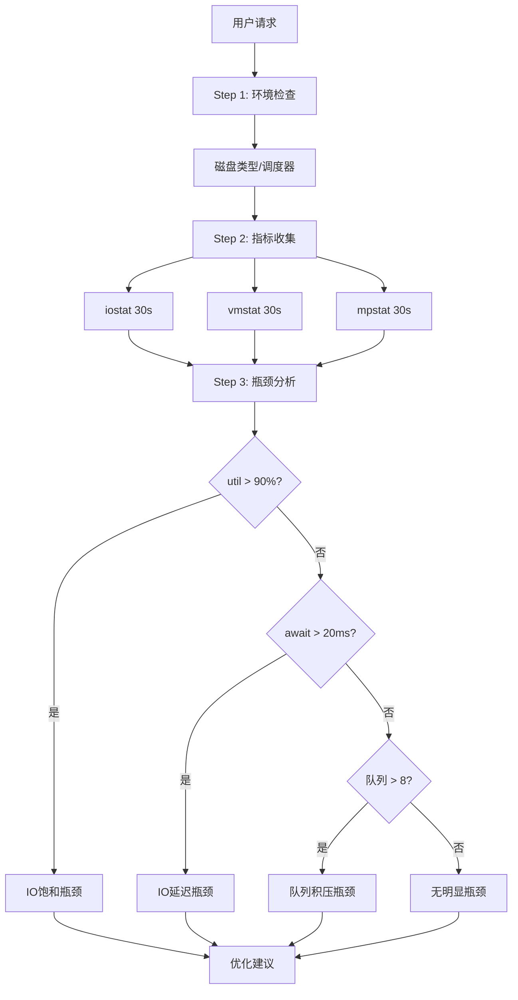
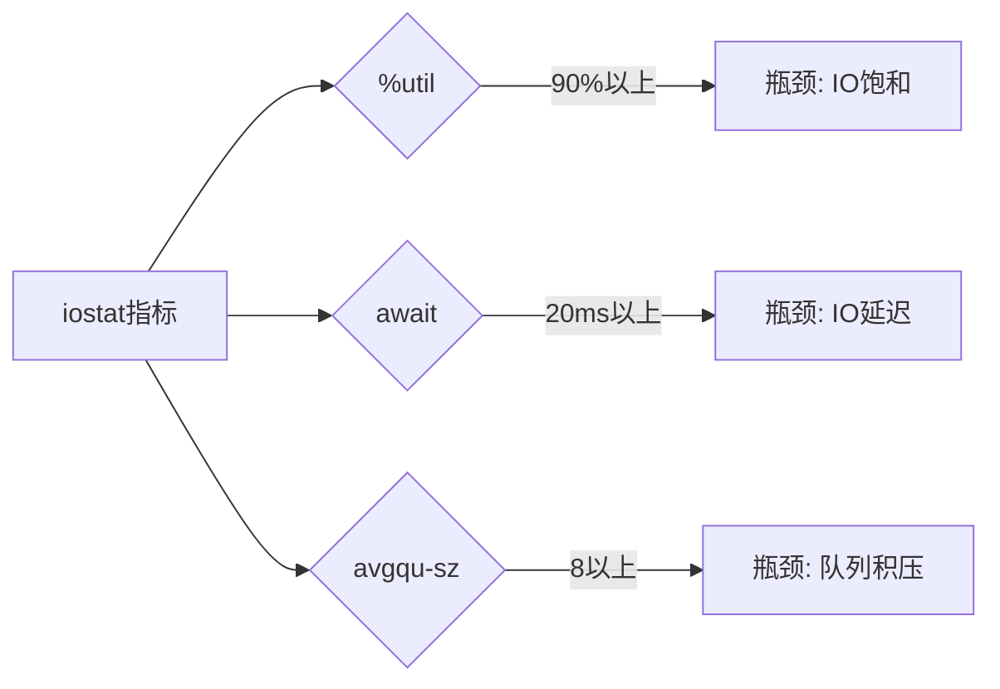

# io-bottleneck 设计文档

## 使用场景

### 典型场景

1. **IO问题诊断** - 磁盘利用率高、IO等待高
2. **top-down补充** - 全局分析后深入IO层面
3. **优化前分析** - IO优化前确定瓶颈

### 不适用

- 应用层IO问题 - 使用application-bottleneck
- 已知需应用优化 - 不是IO问题

## 瓶颈判定规则

```bash
# iostat关键指标
%util > 90%   → IO饱和
await > 20ms   → IO延迟高
avgqu-sz > 8   → 队列积压
svctm > 10ms  → 设备延迟

# vmstat关键指标
wa > 20%       → IO等待高
b > 0           → 有阻塞进程

# mpstat
%iowait > 20% → CPU等待IO
```

## 分析流程

```
Step 1: 环境检查
├→ 磁盘类型 (SSD/HDD)
├→ 调度器
└→ 可用队列深度

Step 2: 指标收集 (30s)
├→ vmstat 1 30
├→ iostat -xz 1 30
└→ mpstat -P ALL 1 30

Step 3: 瓶颈分析
├→ IO饱和分析
├→ 延迟分析
└→ 队列分析

Step 4: 优化建议
└→ 输出优化策略
```

## 流程图 (Mermaid)

### 主流程图



### 瓶颈判定规则



## 异常处理

| 异常 | 处理 |
|------|------|
| 工具缺失 | 报告安装方法 |
| 权限不足 | 降级分析 |
| 数据收集失败 | 部分收集 |
