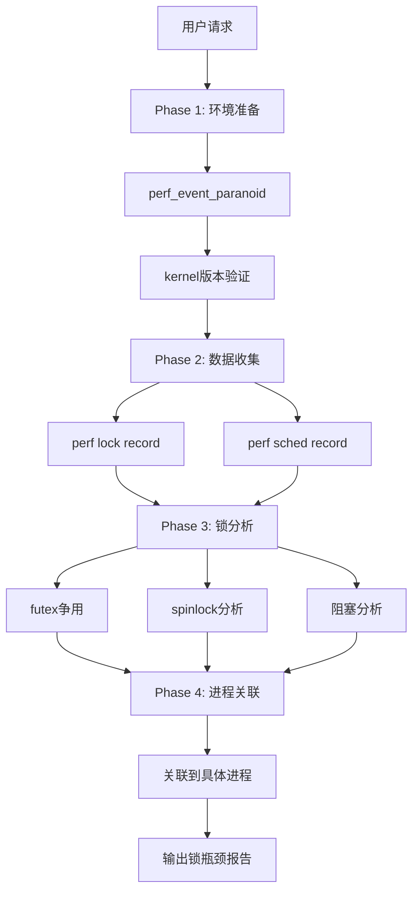
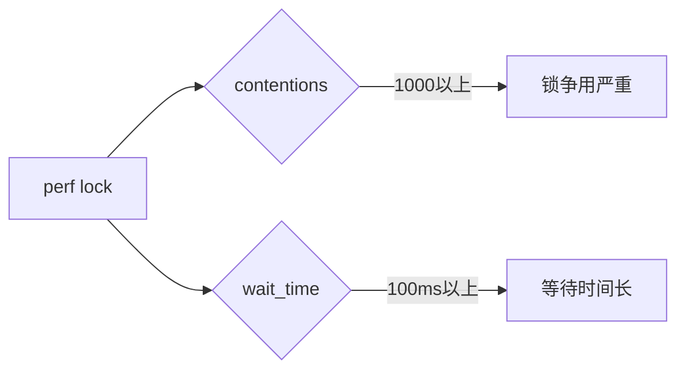

# lock-bottleneck 设计文档

## 瓶颈判定规则

```bash
# perf lock分析
 contentions > 1000  → 锁争用严重
 wait_time > 100ms   → 等待时间长

# perf sched
 sched_switch > 50%   → 频繁调度
```

## 分析流程

```
Phase 1: 环境准备
├→ perf_event_paranoid检查
├→ lock_stat检查
└→ kernel版本验证

Phase 2: 数据收集
├→ perf lock record
└→ perf sched record

Phase 3: 锁分析
├→ futex争用分析
├→ spinlock分析
└→ 阻塞分析

Phase 4: 进程关联
└→ 关联到具体进程
```

## 流程图 (Mermaid)

### 主流程图



### 瓶颈判定


