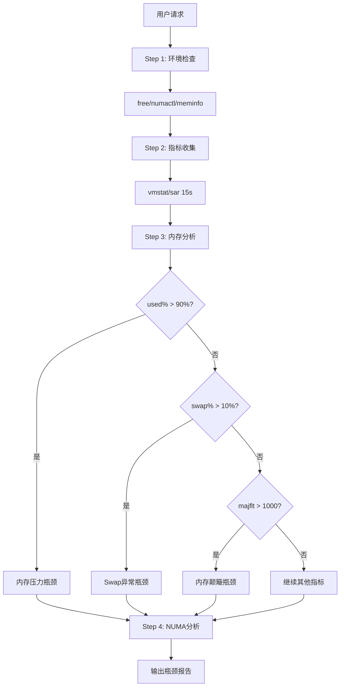
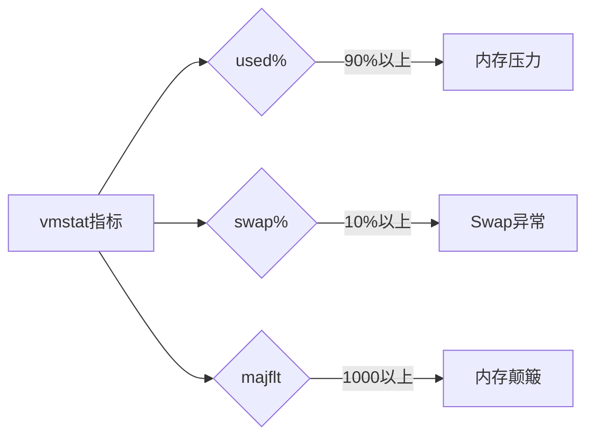

# mem-bottleneck 设计文档

## 瓶颈判定规则

```bash
# vmstat/sar关键指标
used% > 90%   → 内存压力
swap% > 10%   → Swap异常活跃
si/so > 10MB  → 内存颠簸
majflt > 1000  → 严重页错误

# slab
Slab > 30%     → 内核内存压力
```

## 分析流程

```
Step 1: 环境检查
├→ free -h
├→ numactl --hardware
└→ cat /proc/meminfo

Step 2: 指标收集 (15s)
├→ vmstat 1 15
├→ sar -r 1 15
└→ sar -B 1 15

Step 3: 内存分析
├→ 压力分析
├→ Swap分析
└→ Slab分析

Step 4: NUMA分析 (如适用)
└→ 跨节点访问检测
```

## 流程图 (Mermaid)

### 主流程图



### 瓶颈判定


