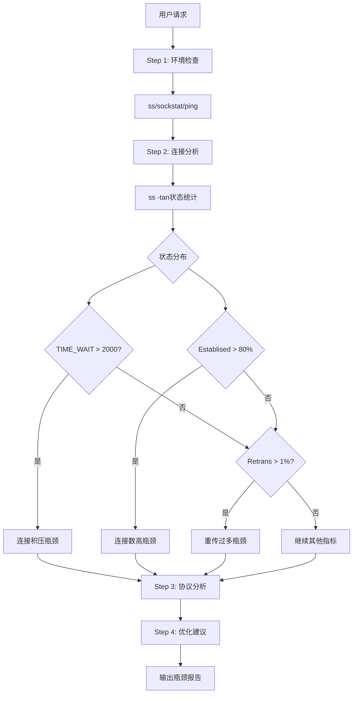
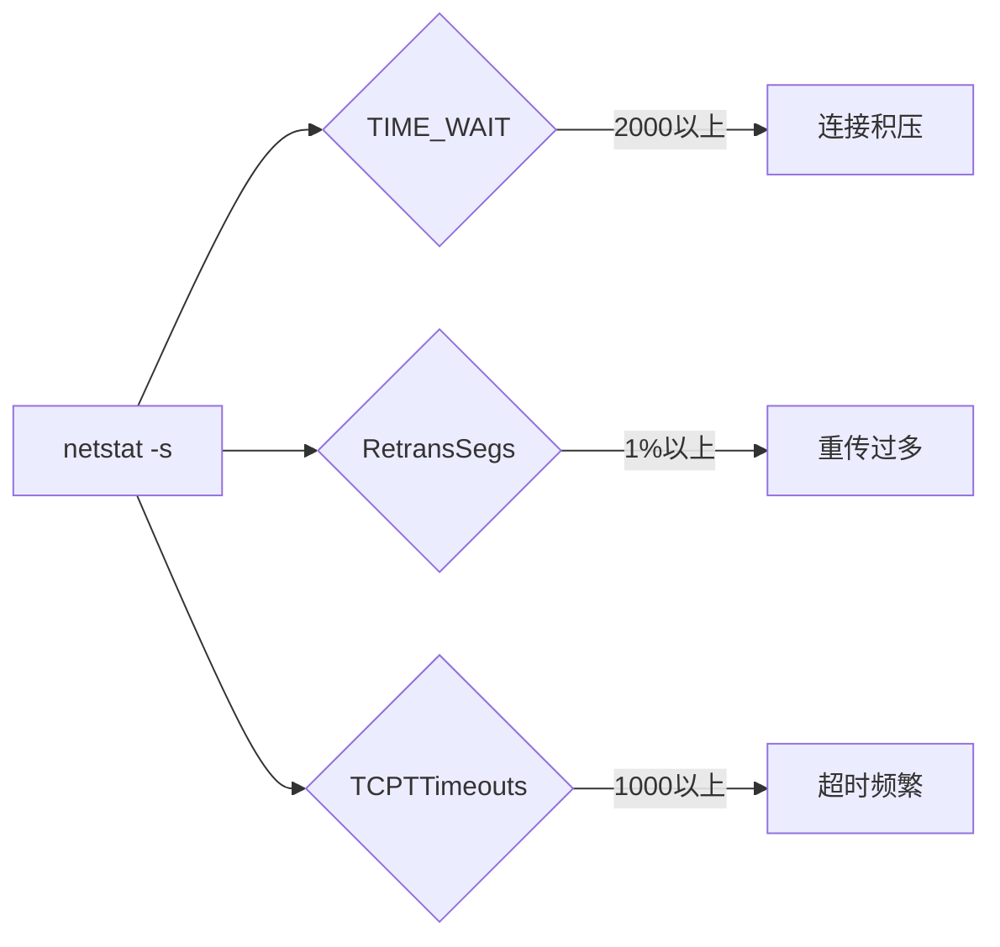

# net-bottleneck 设计文档

## 瓶颈判定规则

```bash
# ss -s 关键指标
TIME_WAIT > 2000  → 连接积压
Establised > 80%   → 连接数高

# netstat -s
RetransSegs > 1%   → 重传过多
TCPTTimeouts > 1000 → 超时频繁

# ping
rtt > 5ms          → 延迟异常
```

## 分析流程

```
Step 1: 环境检查
├→ ss -s
├→ cat /proc/net/sockstat
└→ ping测试

Step 2: 连接分析
├→ ss -tan状态统计
└→ 连接状态分布

Step 3: 协议分析
├→ netstat -s重传统计
└→ TCP窗口分析

Step 4: 优化建议
└→ tcp_tw_reuse等
```

## 流程图 (Mermaid)

### 主流程图



### 瓶颈判定


