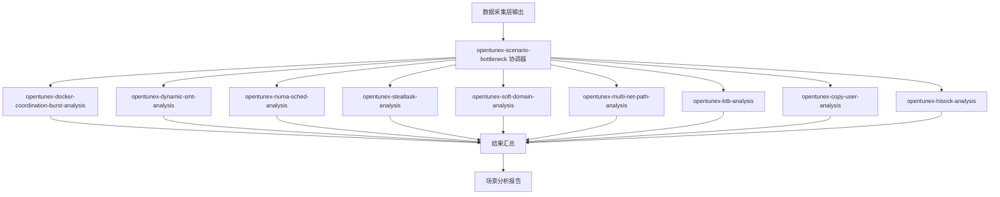

# opentunex-scenario-bottleneck 设计文档

## 使用场景

### 典型场景

1. **容器CPU瓶颈诊断** - 容器CPU限流、宿主机有空闲算力时评估 burst 适用性
2. **SMT超线程优化** - CPU使用率低、超线程干扰场景下评估动态SMT调优
3. **NUMA调度优化** - NUMA内存不均衡、跨节点访问率高时评估调度并行调优
4. **窃取任务调度优化** - CPU高负载、负载不均衡时评估窃取任务调优
5. **分域调度优化** - 多NUMA节点、小配额多实例容器/进程场景，评估soft_domain调优以减少跨NUMA调度抖动
6. **网卡多路径瓶颈优化** - 多网卡多NUMA环境下评估oenetcls/venetcls内核模块接管中断亲和
7. **BTB分支预测优化** - 鲲鹏920新型号 + redis/mysql关键进程场景，评估禁用TidCMP消除线程分支预测记录隔离
8. **copy_from_user拷贝优化** - ARM64 Hisilicon CPU + 大块读写热点场景，评估应用ldp/ldtp双字加载优化补丁
9. **hisock网络加速优化** - nf_hook热点场景，评估eBPF加速策略绕过L2/L3 netfilter开销

### 不适用

- 通用系统瓶颈分析 - 使用 opentunex-top-down-bottleneck
- 应用层瓶颈分析 - 使用 opentunex-application-bottleneck
- IO/网络/内存/锁专项瓶颈 - 使用对应的专项瓶颈分析技能

## 架构设计

### 协调器模式

本技能采用协调器模式，自身不执行分析逻辑，仅负责：
1. 全量调度所有场景分析子技能并行执行
2. 汇总各子技能的分析结果

### 子技能原子化

每个子技能是独立的、自包含的分析单元：
- 包含完整的环境检查 → 特征分析 → 适用性评估 → 瓶颈定位流程
- 可独立运行，不依赖其他子技能的结果
- 自行判断适用性，输出"适用/收益有限/不适用"结论

### 动态发现

协调器通过扫描 `references/` 目录下 `opentunex-*` 前缀的子目录动态发现场景分析技能，新增场景时只需在 `references/` 下创建新的子目录并包含 `analysis-guide.md` 即可，无需修改协调器逻辑。

## 分析流程

```
Step 1: 数据接收
├→ 从数据采集层读取系统指标
└→ 校验数据完整性

Step 2: 全量调度（并行）
├→ opentunex-docker-coordination-burst-analysis
├→ opentunex-dynamic-smt-analysis
├→ opentunex-numa-sched-analysis
├→ opentunex-stealtask-analysis
├→ opentunex-soft-domain-analysis
├→ opentunex-multi-net-path-analysis
├→ opentunex-btb-analysis
├→ opentunex-copy-user-analysis
└→ opentunex-hisock-analysis

Step 3: 结果汇总
├→ 适用性分类
├→ 关键发现提取
└→ 结构化报告输出
```

## 流程图



## 子技能决策矩阵

| 子技能 | 适用条件 | 不适用条件 |
|--------|---------|-----------|
| Docker算力统筹 | 宿主机低负载 + 容器CPU受限 + 内核支持burst | 宿主机高负载 / 内核不支持 / 无容器 |
| 动态SMT | CPU低负载 + SMT已启用 + 内核支持KEEP_ON_CORE | CPU高负载 / SMT未启用 / 内核不支持 |
| numa并行感知调度 | 多NUMA节点 + 跨节点访问率高 + PARAL未启用 | 单NUMA节点 / PARAL已启用 / 内核不支持 |
| 窃取任务调度 | CPU高负载 + 负载不均衡 + STEAL未启用 | 内核不支持CONFIG_SCHED_STEAL / STEAL已启用 |
| 分域调度 | 多NUMA节点 + 小配额多实例容器/进程 + SOFT_DOMAIN未启用 + debugfs可写 | 单NUMA节点 / SOFT_DOMAIN已启用 / 非aarch64 / debugfs不可写 |

## 异常处理

| 异常 | 处理 |
|------|------|
| 数据采集层数据缺失 | 提示用户先完成数据采集 |
| 子技能执行失败 | 标记为"执行失败"，继续其他子技能 |
| 所有子技能不适用 | 在报告中明确说明，建议关注通用分析 |
| 工具缺失 | 子技能自行降级处理或报告 |
| 权限不足 | 子技能自行降级处理或报告 |