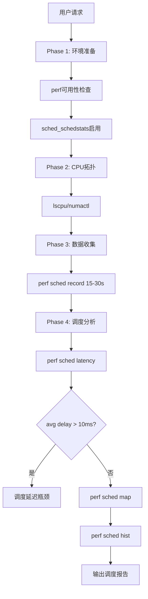
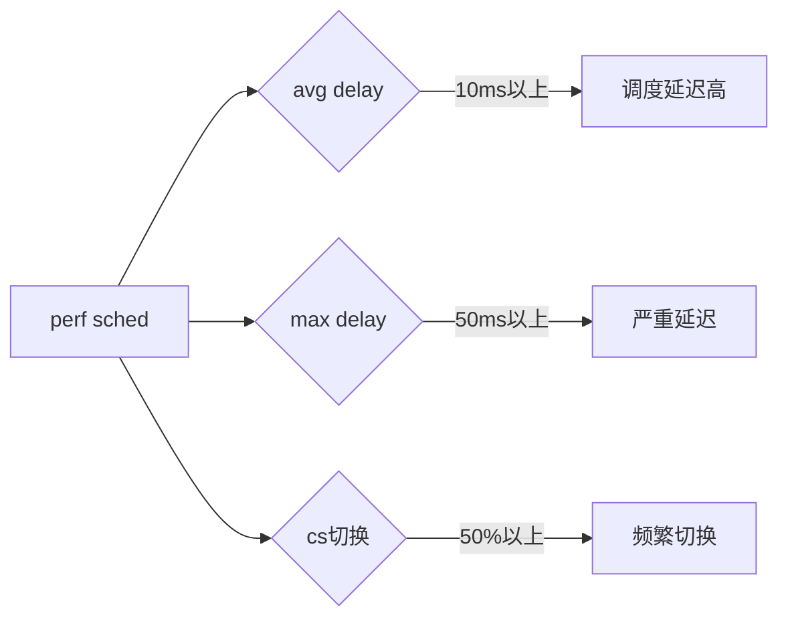

# schedule-trace-analysis 设计文档

## 瓶颈判定规则

```bash
# perf sched延迟
avg delay > 10ms    → 调度延迟高
max delay > 50ms    → 严重延迟

# perf sched切换
cs > 50%            → 频繁上下文切换
```

## 分析流程

```
Phase 1: 环境准备
├→ kernel版本检查
├→ perf可用性
└→ sched_schedstats启用

Phase 2: CPU拓扑
├→ lscpu
├→ numactl --hardware
└→ /proc/cpuinfo

Phase 3: 数据收集
├→ perf sched record
└→ 采集15-30s

Phase 4: 调度分析
├→ perf sched latency
├→ perf sched map
└→ perf sched hist
```

## 流程图 (Mermaid)

### 主流程图



### 瓶颈判定


