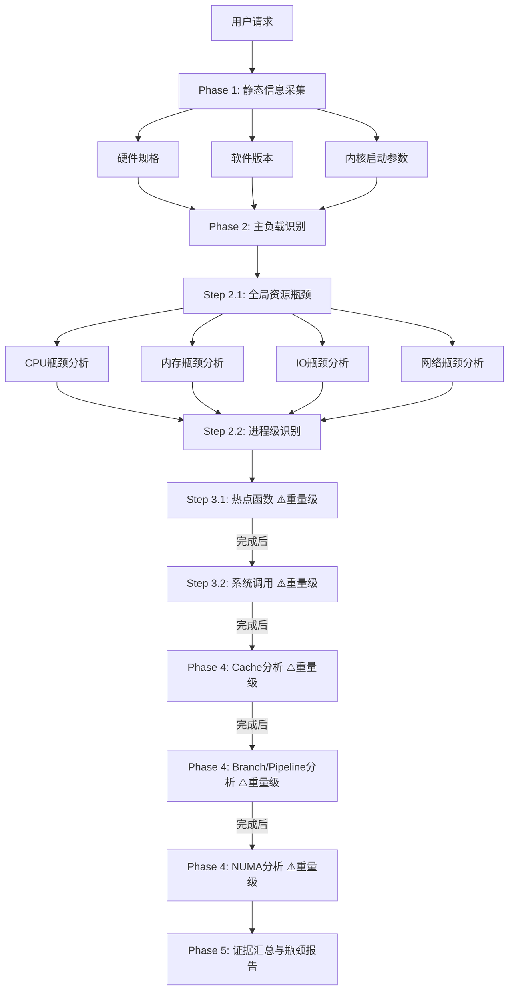
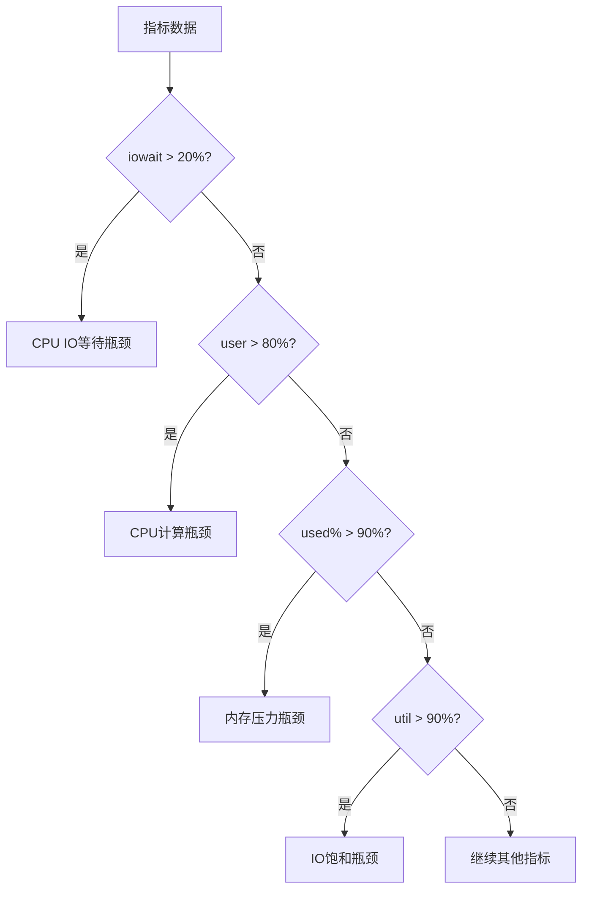

# top-down-bottleneck 设计文档

## 使用场景

### 典型场景

1. **首次诊断** - 未知问题首先执行此分析
2. **性能评估** - 系统级性能基线检查
3. **瓶颈定位** - 识别系统级资源瓶颈
4. **分层分析** - OS问题 vs 应用问题分离

### 不适用场景

- 已知是应用问题 - 使用application-bottleneck
- 已知是特定资源 - 使用io-bottleneck/mem-bottleneck等
- 需要trace分析 - 使用schedule-trace-analysis

## 模块架构

```
top-down-bottleneck
├── SKILL.md                          # 主Skill文件
├── scripts/                          # 一键采集脚本
│   ├── phase1-static-info.sh         # 无参数
│   ├── phase2.1-global-bottleneck.sh # 无参数
│   ├── phase2.2-top-processes.sh     # 无参数
│   ├── phase3.1-hotspot-function.sh  # <PID>
│   ├── phase3.2-syscall-analysis.sh  # <PID>
│   └── phase4-microarch.sh           # <PID>
├── Phase 1: 系统环境静态信息采集 (硬件规格/软件版本/内核启动参数)
├── Phase 2: 主负载识别与瓶颈分析
│   ├── Step 2.1: 全局资源瓶颈识别 (CPU/Memory/IO/Network)
│   └── Step 2.2: 高资源消耗进程识别
├── Phase 3: 热点函数与系统调用分析
│   ├── Step 3.1: 热点函数分析 (perf)
│   └── Step 3.2: 系统调用分析 (strace)
├── Phase 4: 微架构瓶颈分析 (PMU events)
├── Phase 5: 基于证据的瓶颈分析
└── references/                       # (如需要)
```

## 工作流图 (4+1视图)

### 1. 场景视图

```
┌─────────────────┐
│ 用户请求        │
│ "分析瓶颈"     │
└────────┬────────┘
         │
         ▼
┌─────────────────────────────────────────────────────────────┐
│                top-down-bottleneck                           │
│                                                              │
│  Phase 1: 系统环境静态信息采集                               │
│  ┌───────────────────────────────────────────────────────┐  │
│  │ 硬件规格: CPU/内存/磁盘/网卡                          │  │
│  │ 软件版本: OS/内核/工具                                │  │
│  │ 内核启动参数: cmdline/sysctl/模块                      │  │
│  └───────────────────────────────────────────────────────┘  │
│                                                              │
│  Phase 2: 主负载识别与瓶颈分析                               │
│  ├→ Step 2.1: 全局资源瓶颈识别                              │
│  └→ Step 2.2: 高资源消耗进程识别                            │
│                                                              │
│  Phase 3: 热点函数与系统调用分析 ⚠️重量级 - 必须串行     │
│  ├→ Step 3.1: 热点函数分析 (perf)                        │
│  │   完成后 →                                             │
│  └→ Step 3.2: 系统调用分析 (strace)                      │
│      完成后 →                                             │
│                                                           │
│  Phase 4: 微架构瓶颈分析 ⚠️重量级 - 必须串行              │
│  └→ PMU events: cache → branch/pipeline → NUMA (依次执行) │
│                                                              │
│  Phase 5: 基于证据的瓶颈分析                                 │
│  └→ 瓶颈映射 + 严重程度 + 优化建议                          │
└────────┬────────────────────────────────────────────────────┘
         │
         ▼
┌─────────────────────────────────────┐
│       输出: 系统瓶颈报告               │
│  - 瓶颈层级 (CPU/Mem/IO/Net)        │
│  - 证据 (指标数值)                   │
│  - 建议 (初步优化方向)               │
└─────────────────────────────────────┘
```

### 2. 活动视图 (Phase 1)

```
┌─────────────────────────────────────────────────────────────┐
│        Phase 1: 系统环境静态信息采集                          │
├─────────────────────────────────────────────────────────────┤
│                                                              │
│  ┌─────────────┐  ┌─────────────┐  ┌─────────────┐        │
│  │ 硬件规格    │  │ 软件版本    │  │ 内核启动参数 │        │
│  │ lscpu       │  │ os-release  │  │ /proc/cmdline│       │
│  │ dmidecode   │  │ uname -r    │  │ sysctl -a   │        │
│  │ lsblk       │  │ tool -V     │  │ lsmod       │        │
│  │ lspci       │  │ gcc/glibc   │  │ THP/sched   │        │
│  └─────────────┘  └─────────────┘  └─────────────┘        │
│                                                              │
│  输出: 系统静态画像 (不含动态运行时指标)                      │
└─────────────────────────────────────────────────────────────┘
```

### 3. 活动视图 (Phase 2 全局资源分析)

```
┌─────────────────────────────────────────────────────────────┐
│           Step 2.1: 全局资源瓶颈分析                        │
├─────────────────────────────────────────────────────────────┤
│                                                              │
│  ┌──────────────┐  ┌──────────────┐                        │
│  │ CPU分析      │  │ 内存分析     │                        │
│  │              │  │              │                        │
│  │ iowait > 20% │  │ used > 90%  │                        │
│  │ steal > 10%  │  │ swap > 10%   │                        │
│  │ %user > 80%  │  │ majflt > 1k │                        │
│  └──────┬───────┘  └──────┬───────┘                        │
│         │                   │                                │
│         ▼                   ▼                                │
│  ┌──────────────┐  ┌──────────────┐                        │
│  │ IO分析       │  │ 网络分析     │                        │
│  │              │  │              │                        │
│  │ %util > 90%  │  │ retx > 1%    │                        │
│  │ await > 20ms │  │ TCP timeout  │                        │
│  │ queue > 8    │  │ conntbl > 80% │                       │
│  └──────────────┘  └──────────────┘                        │
│                                                              │
└─────────────────────────────────────────────────────────────┘
```

### 4. 交互视图

```
用户                    Skill
  │                      │
  │ 分析请求             │
  │─────────────────────▶│
  │                      │
  │                      │ Phase 1: 采集静态信息
  │                      │ - 硬件规格
  │                      │ - 软件版本
  │                      │ - 内核启动参数
  │                      │
  │                      │ Phase 2: 动态瓶颈分析
  │                      │ - 2.1 全局资源瓶颈
  │                      │ - 2.2 高消耗进程识别
  │                      │
  │                      │ Phase 3: 热点分析
  │                      │ - 3.1 perf热点函数
  │                      │ - 3.2 strace系统调用
  │                      │
  │                      │ Phase 4: 微架构分析
  │                      │ - cache/branch/pipeline
  │                      │
  │                      │ Phase 5: 证据汇总
  │                      │ - 瓶颈映射 + 建议
  │                      │
  │◀─────────────────────│ 瓶颈报告
  │                      │
```

## 流程图 (Mermaid)

### 主流程图



### 瓶颈判定流程



## 重量级命令约束

**重量级命令**（`perf record`, `perf top`, `perf stat`, `strace`）会attach到目标进程并改变其运行时行为。必须串行运行，等前一组命令完成后才能启动下一组，不得与任何其他采集分析命令同时运行。

---

## 核心业务流程

### 瓶颈判定规则

```bash
# CPU瓶颈规则
IF iowait > 20%:         瓶颈=IO等待, 严重=高
IF steal > 10%:           瓶颈=虚拟化抢占, 严重=高
IF user > 80%:            瓶颈=计算密集, 严重=中
IF cs/s > 50000:           瓶颈=上下文切换, 严重=中

# 内存瓶颈规则
IF used% > 90%:          瓶颈=内存压力, 严重=高
IF swap_in > 10MB/s:      瓶颈=交换活动, 严重=高
IF majflt/s > 1000:       瓶颈=内存颠簸, 严重=高

# IO瓶颈规则
IF %util > 90%:          瓶颈=IO饱和, 严重=高
IF await > 20ms:         瓶颈=IO延迟, 严重=中
IF avgqu-sz > 8:         瓶颈=队列积压, 严重=中

# 网络瓶颈规则
IF RetrSegs > 1%:        瓶颈=丢包/重传, 严重=中
IF TCPTimeouts > 1000:   瓶颈=TCP超时, 严重=中
IF sockets > 80%:        瓶颈=socket耗尽, 严重=高
```

## 异常情形处理

| 异常 | 处理 |
|------|------|
| 工具缺失 | 报告缺失工具，跳过相关分析 |
| 权限不足 | perf需要root，分析降级 |
| 数据收集超时 | 提供已收集数据，标记超时 |
| 分析脚本错误 | 输出原始数据，报告错误 |
