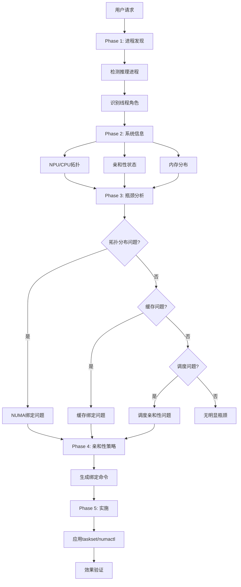
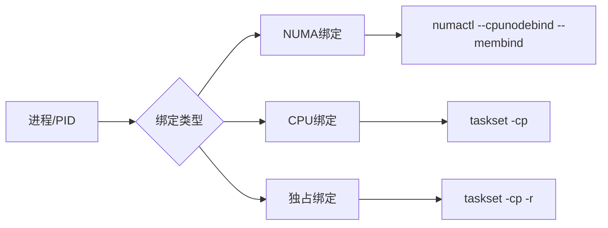

# inference-core-binding-optimization 设计文档

## 使用场景

### 典型场景

1. **NPU推理优化** - NPU/vLLM-Ascend推理
2. **延迟抖动** - 推理延迟不稳定
3. **拓扑优化** - CPU/NUMA分布不合理

## 模块架构

```
inference-core-binding-optimization
├── SKILL.md                          # 主Skill文件
└── references/
    ├── topo-info.md                  # 拓扑信息收集
    ├── bottleneck.md                  # 瓶颈分析
    └── affinity.md                    # 亲和性策略
```

## 分析流程

```
Phase 1: 关键进程发现
├→ 进程检测
├→ 线程识别
└→ 角色分类

Phase 2: 系统信息收集
├→ NPU拓扑
├→ CPU拓扑
├→ 亲和性状态
└→ 内存分布

Phase 3: 瓶颈分析
├→ 拓扑分布问题
├→ 缓存问题
└→ 调度问题

Phase 4: 亲和性策略
├→ 绑定方案生成
└→ 验证命令

Phase 5: 实施
├→ 应用绑定
└→ 效果验证
```

## 流程图 (Mermaid)

### 主流程图



### 亲和性绑定流程



```bash
# NUMA绑定
numactl --cpunodebind=0 --membind=0 $PID

# CPU绑定
taskset -cp 0-7 $PID

# 独占CPU
taskset -cp 0-7 -r $PID  # -r for recline
```
