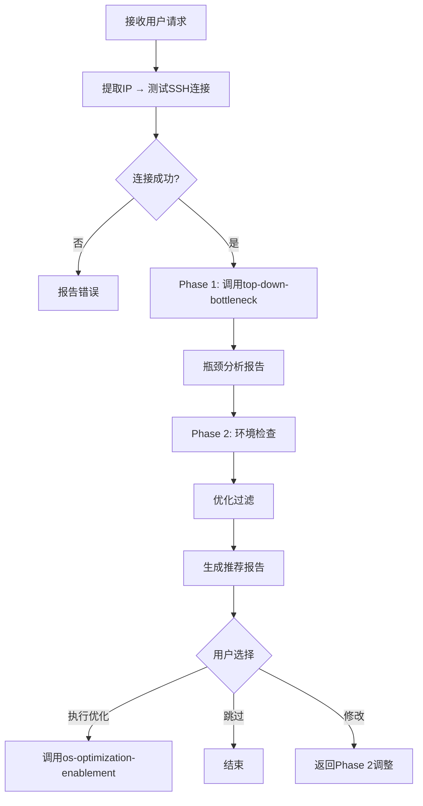
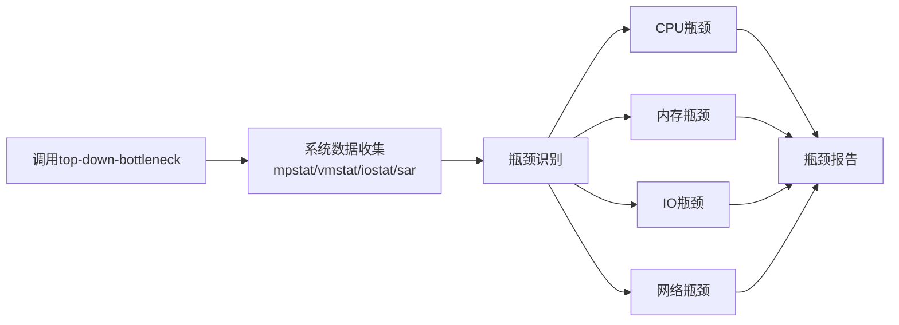
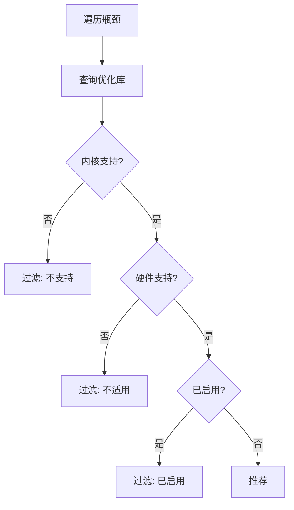

# os-performance-optimization 设计文档

## 使用场景

### 典型场景

1. **系统性能基线评估** - 对新交付系统进行OS级别性能评估
2. **性能问题诊断** - 系统响应慢但应用日志无明显异常时
3. **优化前分析** - 在执行应用优化前先识别OS级别瓶颈
4. **定期巡检** - 周期性系统健康检查

### 不适用场景

- 应用层问题诊断（如SQL慢查询、JVM GC问题）- 使用`application-bottleneck`
- 特定应用性能优化 - 使用`application-optimization`
- 网络延迟问题（网络栈层面）- 使用`net-bottleneck`

## 模块架构

```
os-performance-optimization
├── SKILL.md                          # 主Skill文件
└── references/
    └── optimizations/                 # 优化策略库
        ├── cpu.md                    # CPU优化策略
        ├── memory.md                 # 内存优化策略
        ├── disk.md                   # 磁盘/IO优化策略
        └── network.md                # 网络优化策略
```

### 模块职责

| 模块 | 职责 |
|------|------|
| SKILL.md | 主流程控制，Phase 1-3执行逻辑 |
| top-down-bottleneck skill | Phase 1瓶颈分析（调用外部Skill）|
| references/optimizations/* | 优化策略库，包含各类优化项详情 |

## 代码架构

### 核心流程

```
Phase 1: 瓶颈分析
    ↓
    ├→ 调用 top-down-bottleneck skill
    ↓
    └→ 输出: 瓶颈列表 + 证据
    
Phase 2: 优化推荐
    ↓
    ├→ 环境检查 (CPU/Memory/Disk/Network)
    ├→ 优化过滤 (不支持/已启用/不适用)
    ├→ 策略查询 (references/optimizations/)
    ↓
    └→ 输出: 推荐优化项列表
    
Phase 3: 执行确认
    ↓
    └→ 询问用户: 执行优化/跳过/修改
```

### 关键决策点

1. **环境检查** - 验证内核支持、硬件能力、工具可用性
2. **优化过滤** - 过滤条件: 不支持(!可用) OR 已启用(==推荐值) OR 不适用
3. **用户确认** - 三选一: 执行优化/跳过/修改列表

## 工作流图 (4+1视图)

### 1. 场景视图

```
用户视角:
┌─────────────────┐     ┌──────────────────────────────┐
│ 输入: 分析请求  │────▶│ os-performance-optimization   │
│ (含目标IP)     │     │                              │
└─────────────────┘     │  Phase 1: 瓶颈分析          │
                        │      ↓                       │
                        │  Phase 2: 优化推荐          │
                        │      ↓                       │
                        │  Phase 3: 执行确认         │
                        │      ↓                       │
                        └──────────────────────────────┘
                                   │
                    ┌──────────────┼──────────────┐
                    ▼              ▼              ▼
            ┌───────────┐  ┌───────────┐  ┌───────────┐
            │ OPT-1    │  │ OPT-2    │  │ OPT-3    │
            │ (采纳)   │  │ (采纳)   │  │ (跳过)   │
            └───────────┘  └───────────┘  └───────────┘
                    │              │
                    ▼              ▼
            ┌───────────────────────────┐
            │ os-optimization-enablement │
            │ (应用优化)                │
            └───────────────────────────┘
```

### 2. 活动视图

```
┌─────────────────────────────────────────────────────────────┐
│                    Phase 1: 瓶颈分析                         │
├─────────────────────────────────────────────────────────────┤
│  ┌─────────────┐                                           │
│  │加载依赖Skill│                                           │
│  │ top-down-  │                                           │
│  │ bottleneck  │                                           │
│  └──────┬──────┘                                           │
│         │                                                   │
│         ▼                                                   │
│  ┌─────────────────────────────────────────┐               │
│  │ 执行系统级瓶颈分析                      │               │
│  │ - CPU utilization                       │               │
│  │ - Memory pressure                       │               │
│  │ - I/O bottleneck                       │               │
│  │ - Network throughput                    │               │
│  └─────────────────┬───────────────────────┘               │
│                    │                                        │
│                    ▼                                        │
│  ┌─────────────────────────────────────────┐               │
│  │ 输出: 瓶颈报告 (含严重程度/证据)       │               │
│  └─────────────────────────────────────────┘               │
└─────────────────────────────────────────────────────────────┘
                    │
                    ▼
┌─────────────────────────────────────────────────────────────┐
│                    Phase 2: 优化推荐                         │
├─────────────────────────────────────────────────────────────┤
│  ┌─────────────────────────────────────────┐               │
│  │ 环境检查                                │               │
│  │ - kernel版本/特性                       │               │
│  │ - 硬件能力 (NUMA/HT/SSD)               │               │
│  │ - 当前配置值                            │               │
│  └─────────────────┬───────────────────────┘               │
│                    │                                        │
│                    ▼                                        │
│  ┌─────────────────────────────────────────┐               │
│  │ 优化过滤                                │               │
│  │ - 不支持 ──────▶ 过滤                   │               │
│  │ - 已启用 ──────▶ 过滤                   │               │
│  │ - 不适用 ──────▶ 过滤                   │               │
│  │ - 适用 ────────▶ 保留                   │               │
│  └─────────────────┬───────────────────────┘               │
│                    │                                        │
│                    ▼                                        │
│  ┌─────────────────────────────────────────┐               │
│  │ 输出: 优化推荐列表                      │               │
│  └─────────────────────────────────────────┘               │
└─────────────────────────────────────────────────────────────┘
                    │
                    ▼
┌─────────────────────────────────────────────────────────────┐
│                    Phase 3: 执行确认                       │
├─────────────────────────────────────────────────────────────┤
│  ┌─────────────────────────────────────────┐               │
│  │ 用户选择:                               │               │
│  │ 1. 执行优化使能 → os-optimization-      │               │
│  │    enablement                           │               │
│  │ 2. 跳过                                 │               │
│  │ 3. 修改列表                             │               │
│  └─────────────────────────────────────────┘               │
└─────────────────────────────────────────────────────────────┘
```

### 3. 交互视图

```
用户 ──── 输入请求 ──────────────────────────────────────▶ Skill
          │
          │  (IP: 192.168.1.100)
          ▼
    ┌─────────────────────────────────────────┐
    │ Phase 1: 调用 top-down-bottleneck       │
    └─────────────────┬───────────────────────┘
                      │
                      ▼ (瓶颈报告)
    ┌─────────────────────────────────────────┐
    │ Phase 2: 环境检查 + 优化过滤 + 推荐    │
    └─────────────────┬───────────────────────┘
                      │
                      ▼ (推荐报告)
    ┌─────────────────────────────────────────┐
    │ Phase 3: 展示推荐 → 用户确认           │
    └─────────────────┬───────────────────────┘
                      │
          ┌───────────┴───────────┐
          ▼                       ▼
    ┌───────────┐           ┌───────────┐
    │ Option 1  │           │ Option 2  │
    │ (执行)    │           │ (跳过)    │
    └─────┬─────┘           └───────────┘
          │
          ▼
    ┌─────────────────────────────────────────┐
    │ 调用 os-optimization-enablement         │
    └─────────────────────────────────────────┘
```

### 4. 时序视图

```
用户                    Skill                    Top-Down        OS-Opt-
                                             Bottleneck      Enablement
  │                      │                         │              │
  │ 分析请求(IP)         │                         │              │
  │────────────────────▶│                         │              │
  │                      │                         │              │
  │                      │ Phase 1: 调用依赖      │              │
  │                      │────────────────────────▶              │
  │                      │                         │              │
  │                      │◀────────────────────────              │
  │                      │   瓶颈报告              │              │
  │                      │                         │              │
  │                      │ Phase 2: 环境检查      │              │
  │                      │◀──────────────────────│              │
  │                      │   系统信息              │              │
  │                      │                         │              │
  │                      │ Phase 2: 优化过滤+推荐 │              │
  │                      │────────────────────────▶              │
  │                      │                         │              │
  │◀─────────────────────│   推荐报告              │              │
  │                      │                         │              │
  │ 用户确认             │                         │              │
  │─────────────────────▶│                         │              │
  │                      │                         │              │
  │                      │ 执行(调用Enablement)    │              │
  │                      │─────────────────────────────────────▶│
  │                      │                         │              │
  │◀─────────────────────│                         │              │
  │   完成/跳过          │                         │              │
```

### 5. 部署视图

```
┌──────────────────────────────────────────────────────────────┐
│                        本地机器                              │
│  ┌──────────────────────────────────────────────────────┐   │
│  │ OpenCode Agent                                      │   │
│  │  ┌─────────────────────┐                           │   │
│  │  │ os-performance-      │                           │   │
│  │  │ optimization skill   │                           │   │
│  │  └──────────┬──────────┘                           │   │
│  │             │                                       │   │
│  │  ┌──────────▼──────────┐                           │   │
│  │  │ remote-execution    │                           │   │
│  │  │ skill              │                           │   │
│  │  └─────────────────────┘                           │   │
│  └──────────────────────┬──────────────────────────────┘   │
└──────────────────────────│SSH│──────────────────────────────┘
                           │
                           │ SSH
                           ▼
┌──────────────────────────────────────────────────────────────┐
│                     目标服务器 (192.168.1.100)                │
│  ┌──────────────────────────────────────────────────────┐   │
│  │  OS层性能数据收集                                    │   │
│  │  - mpstat, vmstat, iostat                          │   │
│  │  - sysctl, free, lsblk                             │   │
│  │  - perf (如需要)                                   │   │
│  └──────────────────────────────────────────────────────┘   │
└──────────────────────────────────────────────────────────────┘

## 流程图 (Mermaid)

### 主流程图



### Phase 1 瓶颈分析



### Phase 2 优化过滤



## 核心业务流程

### 业务主流程

```
1. 接收用户请求 (含目标IP)
   │
2. 提取客户端IP → 测试SSH连接
   │
3. Phase 1: 调用top-down-bottleneck进行瓶颈分析
   │
4. Phase 2: 
   ├─ 执行环境检查 (内核/硬件/工具)
   ├─ 遍历瓶颈列表，对每项:
   │   └─ 查优化库 → 验证适用性 → 过滤
   └─ 生成推荐报告
   │
5. Phase 3: 用户确认
   ├─ Option 1: 调用os-optimization-enablement
   ├─ Option 2: 结束
   └─ Option 3: 返回修改
```

### 优化过滤算法

```
For each 瓶颈 in 瓶颈列表:
    优化项 = 查询优化库(瓶颈类别)
    
    For each 优化 in 优化项:
        // 检查1: 内核支持?
        IF NOT 内核支持(优化):
            标记: 过滤(不支持)
            CONTINUE
        
        // 检查2: 硬件支持?
        IF NOT 硬件支持(优化):
            标记: 过滤(不适用)
            CONTINUE
        
        // 检查3: 已启用?
        IF 当前值 == 推荐值:
            标记: 过滤(已启用)
            CONTINUE
        
        // 通过所有检查
        标记: 推荐
```

## 异常情形处理

| 异常 | 场景 | 处理方式 |
|------|------|----------|
| SSH连接失败 | 无法连接到目标服务器 | 提示检查网络/认证信息 |
| top-down-bottleneck执行失败 | 依赖Skill执行异常 | 报告错误，建议手动执行 |
| 内核版本不支持 | 优化项要求内核>=X但实际< X | 过滤并说明原因 |
| 硬件不支持 | 优化项要求SSD但检测到HDD | 过滤并说明原因 |
| 工具缺失 | sysbench/fio等工具未安装 | 报告缺失工具及安装方法 |
| 用户中断 | 用户取消操作 | 保留已收集信息 |
| 超时 | 数据收集超时 | 提供部分结果+超时说明 |

### 错误处理策略

1. **优雅降级**: 部分数据收集失败时，继续分析可收集部分
2. **证据保留**: 所有检查结果均输出，便于人工判断
3. **明确标注**: 无法确定的项目明确标注"未知/需人工确认"
