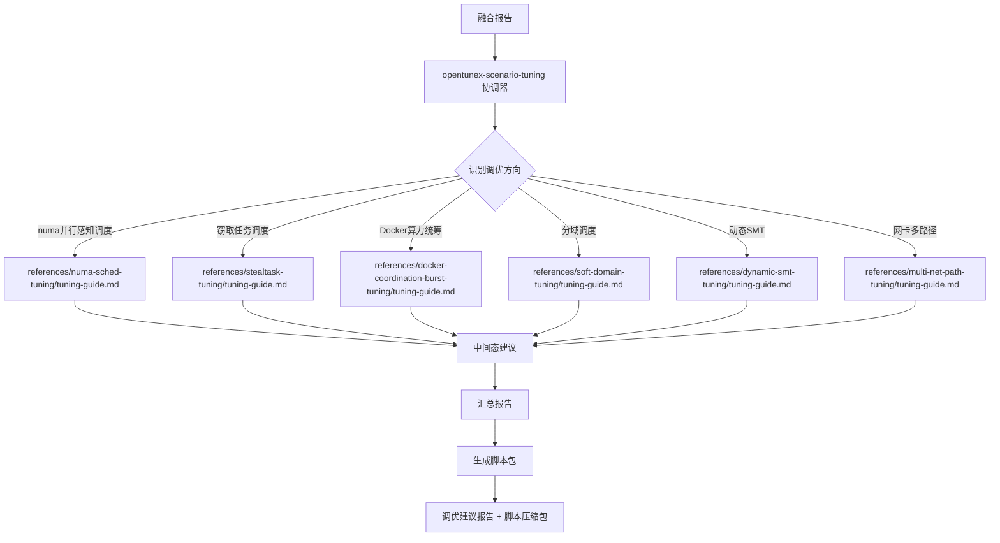

# opentunex-scenario-tuning 设计文档

## 使用场景

### 典型场景

1. **Docker算力统筹调优** - 容器CPU限流、宿主机有空闲算力时，建议启用 sched_soft_runtime_ratio + cpu.soft_quota
2. **numa并行感知调度调优** - NUMA内存不均衡、跨节点访问率高时，建议启用 PARAL 特性
3. **窃取任务调度调优** - CPU高负载、负载不均衡时，建议启用 STEAL 特性

### 不适用

- 通用OS内核参数调优 - 使用 opentunex-os-performance-optimization
- 应用层配置调优 - 使用 opentunex-application-optimization
- 瓶颈分析 - 使用 opentunex-scenario-bottleneck

## 架构设计

### 协调器模式

本技能采用协调器模式，自身不执行调优逻辑，仅负责：
1. 读取融合报告，识别调优方向
2. 按需读取对应调优参考指南（`references/<调优方向>/tuning-guide.md`）
3. 遵循指南流程生成中间态建议，汇总为一份完整报告
4. 生成调优脚本包

### 调优指南原子化

每个调优指南（`tuning-guide.md`）是独立的、自包含的调优建议生成参考：
- 包含完整的调优前提检查 → 建议生成 → 脚本组织流程
- 可独立使用，不依赖其他调优方向的结果
- 自行判断是否适用，输出"适用/不适用"结论

### 按需调度

与瓶颈分析的全量调度不同，调优协调器采用按需调度：
- 仅根据融合报告中明确指定的调优方向生成建议
- 不做全量调度，避免生成无关建议

## 分析流程

```
Step 0: 创建报告目录
└→ 按时间戳归档，更新 latest 链接

Step 1: 读取融合报告
├→ 提取调优执行计划
├→ 提取瓶颈优先级列表
└→ 提取冲突约束

Step 2: 按需读取调优指南
├→ references/docker-coordination-burst-tuning/tuning-guide.md
├→ references/numa-sched-tuning/tuning-guide.md
├→ references/stealtask-tuning/tuning-guide.md
├→ references/soft-domain-tuning/tuning-guide.md
├→ references/dynamic-smt-tuning/tuning-guide.md
└→ references/multi-net-path-tuning/tuning-guide.md

Step 3: 汇总中间态建议
├→ 合并总结表
├→ 按优先级排序
└→ 生成完整报告

Step 4: 生成调优脚本
├→ 从 scripts/ 复制基础脚本
├→ 动态生成入口脚本
└→ 打包压缩

Step 5: 输出报告与打包
```

## 流程图



## 调优指南决策矩阵

| 调优指南 | 适用条件 | 不适用条件 |
|---------|---------|-----------|
| Docker算力统筹调优 | 内核支持 burst + 宿主机低负载 + 有容器CPU受限 | 内核不支持 / 宿主机高负载 / 无容器 |
| numa并行感知调度调优 | 多NUMA节点 + PARAL未启用 + aarch64 | 单NUMA节点 / PARAL已启用 / 非aarch64 |
| 窃取任务调度调优 | CONFIG_SCHED_STEAL启用 + STEAL未启用 + aarch64 | 内核不支持 / STEAL已启用 / 非aarch64 |
| 分域调度调优 | SOFT_DOMAIN支持 + 多NUMA节点 + aarch64 | 内核不支持 / 单NUMA节点 / 非aarch64 |
| 动态SMT调优 | KEEP_ON_CORE支持 + CPU利用率低 | 内核不支持 / CPU高负载 |
| 网卡多路径调优 | oenetcls/venetcls模块可用 + 多网卡 + 多NUMA | 模块不可用 / 单网卡 / 单NUMA |

## 异常处理

| 异常 | 处理 |
|------|------|
| 融合报告缺失 | 提示用户先完成瓶颈分析 |
| 无匹配的调优方向 | 输出"无适用调优方向"结论 |
| 调优方向执行失败 | 标记为"执行失败"，继续其他调优方向 |
| 所有调优方向不适用 | 在报告中明确说明 |
| 工具缺失 | 调优方向自行降级处理或报告 |
| 权限不足 | 调优方向自行降级处理或报告 |