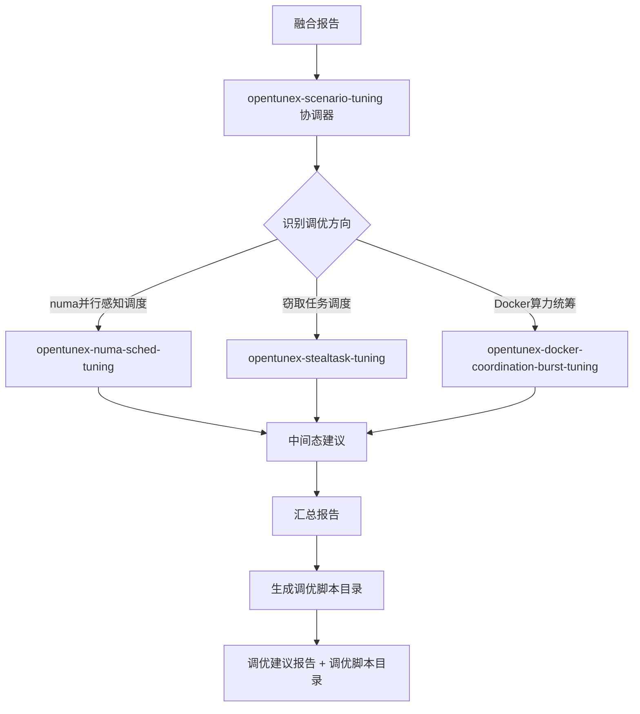

# opentunex-scenario-tuning 设计文档

## 使用场景

### 典型场景

1. **Docker算力统筹调优** - 容器CPU限流、宿主机有空闲算力时，建议启用 sched_soft_runtime_ratio + cpu.soft_quota
2. **numa并行感知调度调优** - NUMA内存不均衡、跨节点访问率高时，建议启用 PARAL 特性
3. **窃取任务调度调优** - CPU高负载、负载不均衡时，建议启用 STEAL 特性

### 不适用

- 通用OS内核参数调优 - 使用 opentunex-os-performance-optimization
- 应用层配置调优 - 使用 opentunex-application-optimization
- 瓶颈分析 - 使用 opentunex-scenario-bottleneck

## 架构设计

### 协调器模式

本技能采用协调器模式，自身不执行调优逻辑，仅负责：
1. 读取融合报告，识别调优方向
2. 按需路由到对应调优子技能
3. 汇总各子技能的中间态建议为一份完整报告
4. 为适用方向生成调优脚本目录（入口脚本 + 基础脚本）

### 子技能原子化

每个子技能是独立的、自包含的调优建议生成单元：
- 包含完整的调优前提检查 → 建议生成 → 脚本组织流程
- 可独立运行，不依赖其他子技能的结果
- 自行判断是否适用，输出"适用/不适用"结论

### 按需调度

与瓶颈分析的全量调度不同，调优协调器采用按需调度：
- 仅根据融合报告中明确指定的调优方向生成建议
- 不做全量调度，避免生成无关建议

## 分析流程

```
Step 0: 创建报告目录
└→ 在 ${WORK_DIR}/tuning/contracts/ 与 ${WORK_DIR}/tuning/intermediate/ 下创建（无时间戳子目录）

Step 1: 读取融合报告
├→ 提取调优执行计划
├→ 提取瓶颈优先级列表
└→ 提取冲突约束

Step 2: 按需路由（串行/并行按批次）
├→ opentunex-docker-coordination-burst-tuning
├→ opentunex-numa-sched-tuning
└→ opentunex-stealtask-tuning

Step 3: 汇总中间态建议
├→ 合并总结表
├→ 按优先级排序
└→ 生成完整报告

Step 4: 生成调优脚本
├→ 复制基础脚本
└→ 动态生成入口脚本

Step 5: 输出报告
```

## 流程图



## 子技能决策矩阵

| 子技能 | 适用条件 | 不适用条件 |
|--------|---------|-----------|
| Docker算力统筹调优 | 内核支持 burst + 宿主机低负载 + 有容器CPU受限 | 内核不支持 / 宿主机高负载 / 无容器 |
| numa并行感知调度调优 | 多NUMA节点 + PARAL未启用 + aarch64 | 单NUMA节点 / PARAL已启用 / 非aarch64 |
| 窃取任务调度调优 | CONFIG_SCHED_STEAL启用 + STEAL未启用 + aarch64 | 内核不支持 / STEAL已启用 / 非aarch64 |

## 异常处理

| 异常 | 处理 |
|------|------|
| 融合报告缺失 | 提示用户先完成瓶颈分析 |
| 无匹配的调优方向 | 输出"无适用调优方向"结论 |
| 子技能执行失败 | 标记为"执行失败"，继续其他子技能 |
| 所有子技能不适用 | 在报告中明确说明 |
| 工具缺失 | 子技能自行降级处理或报告 |
| 权限不足 | 子技能自行降级处理或报告 |