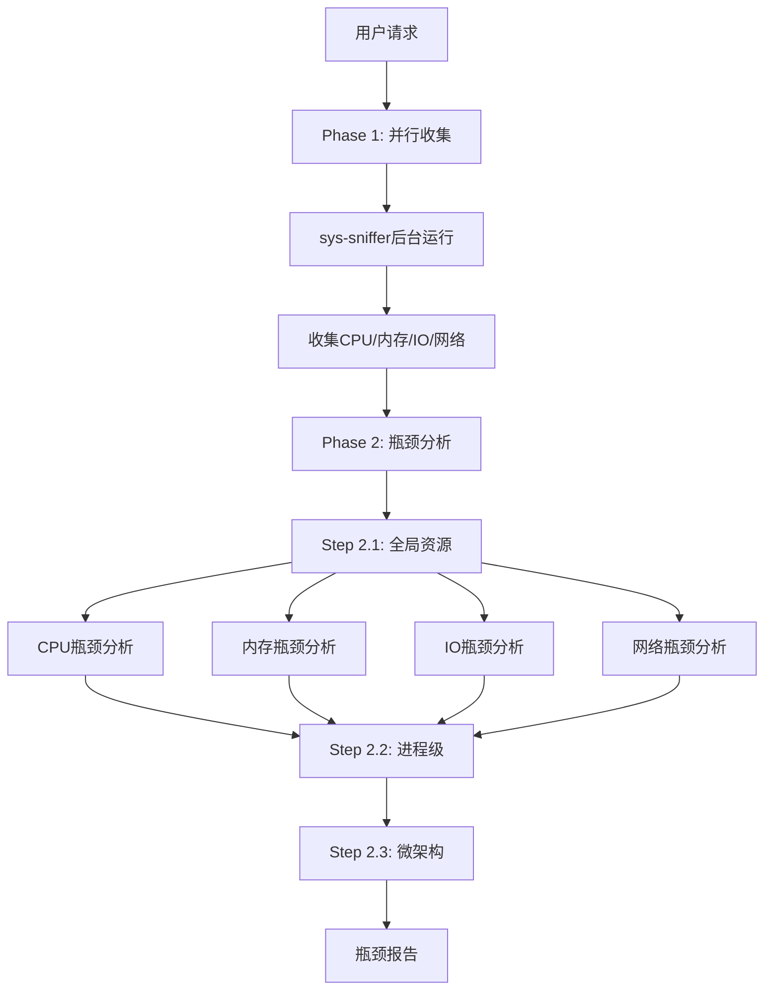
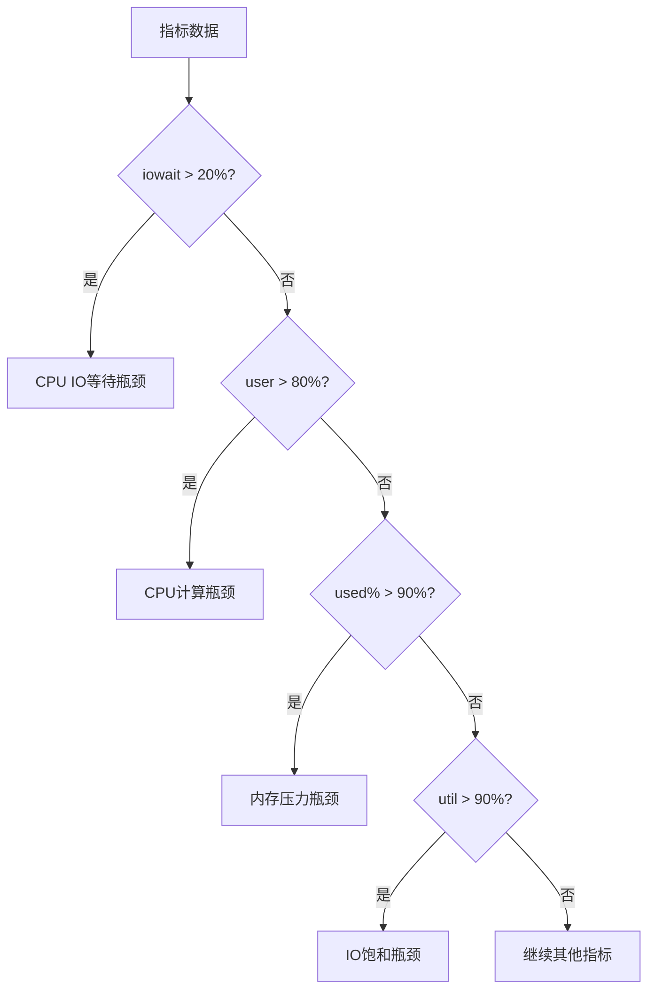

# top-down-bottleneck 设计文档

## 使用场景

### 典型场景

1. **首次诊断** - 未知问题首先执行此分析
2. **性能评估** - 系统级性能基线检查
3. **瓶颈定位** - 识别系统级资源瓶颈
4. **分层分析** - OS问题 vs 应用问题分离

### 不适用场景

- 已知是应用问题 - 使用application-bottleneck
- 已知是特定资源 - 使用io-bottleneck/mem-bottleneck等
- 需要trace分析 - 使用schedule-trace-analysis

## 模块架构

```
top-down-bottleneck
├── SKILL.md                          # 主Skill文件
├── Phase 1: 系统信息收集 (sys-sniffer)
├── Phase 2: 多层瓶颈分析
│   ├── Step 2.1: 全局资源 (CPU/Memory/IO/Network)
│   ├── Step 2.2: 进程级分析
│   └── Step 2.3: 微架构分析
└── references/                       # (如需要)
```

## 工作流图 (4+1视图)

### 1. 场景视图

```
┌─────────────────┐
│ 用户请求        │
│ "分析瓶颈"     │
└────────┬────────┘
         │
         ▼
┌─────────────────────────────────────┐
│       top-down-bottleneck             │
│                                        │
│  Phase 1: 并行收集系统数据            │
│  ┌─────────────────────────────────┐ │
│  │ sys-sniffer (后台)               │ │
│  │ - CPU/Memory/Disk/Network        │ │
│  │ - Kernel/Hardware                │ │
│  └─────────────────────────────────┘ │
│                                        │
│  Phase 2: 瓶颈分析                    │
│  ├→ Step 2.1: 全局资源瓶颈           │
│  ├→ Step 2.2: 进程级分析              │
│  └→ Step 2.3: 微架构分析 (可选)       │
└────────┬────────────────────────────┘
         │
         ▼
┌─────────────────────────────────────┐
│       输出: 系统瓶颈报告               │
│  - 瓶颈层级 (CPU/Mem/IO/Net)        │
│  - 证据 (指标数值)                   │
│  - 建议 (初步优化方向)               │
└─────────────────────────────────────┘
```

### 2. 活动视图 (Phase 1)

```
┌─────────────────────────────────────────────────────────────┐
│              Phase 1: 系统信息收集 (并行)                      │
├─────────────────────────────────────────────────────────────┤
│                                                              │
│  sys-sniffer (后台)                                          │
│  ┌─────────────┐  ┌─────────────┐  ┌─────────────┐        │
│  │ CPU/Mem    │  │ Disk/IO    │  │ Network    │        │
│  │ mpstat     │  │ iostat     │  │ sar -n     │        │
│  │ vmstat     │  │ pidstat -d │  │ ss -s      │        │
│  │ free       │  │             │  │ netstat -s │        │
│  └─────────────┘  └─────────────┘  └─────────────┘        │
│                                                              │
│  sysstat collected in /tmp/system_stats/                     │
└─────────────────────────────────────────────────────────────┘
```

### 3. 活动视图 (Phase 2.1 全局资源分析)

```
┌─────────────────────────────────────────────────────────────┐
│           Step 2.1: 全局资源瓶颈分析                        │
├─────────────────────────────────────────────────────────────┤
│                                                              │
│  ┌──────────────┐  ┌──────────────┐                        │
│  │ CPU分析      │  │ 内存分析     │                        │
│  │              │  │              │                        │
│  │ iowait > 20% │  │ used > 90%  │                        │
│  │ steal > 10%  │  │ swap > 10%   │                        │
│  │ %user > 80%  │  │ majflt > 1k │                        │
│  └──────┬───────┘  └──────┬───────┘                        │
│         │                   │                                │
│         ▼                   ▼                                │
│  ┌──────────────┐  ┌──────────────┐                        │
│  │ IO分析       │  │ 网络分析     │                        │
│  │              │  │              │                        │
│  │ %util > 90%  │  │ retx > 1%    │                        │
│  │ await > 20ms │  │ TCP timeout  │                        │
│  │ queue > 8    │  │ conntbl > 80% │                        │
│  └──────────────┘  └──────────────┘                        │
│                                                              │
└─────────────────────────────────────────────────────────────┘
```

### 4. 交互视图

```
用户                    Skill                 sys-sniffer
  │                      │                        │
  │ 分析请求             │                        │
  │─────────────────────▶│                        │
  │                      │                        │
  │                      │ Phase 1: 启动         │
  │                      │──────────────────────▶│
  │                      │   (后台收集30s)        │
  │                      │◀──────────────────────│
  │                      │   数据收集完成         │
  │                      │                        │
  │                      │ Phase 2: 分析         │
  │                      │ - CPU瓶颈              │
  │                      │ - 内存瓶颈            │
  │                      │ - IO瓶颈              │
  │                      │                        │
    │◀─────────────────────│ 瓶颈报告              │
    │                      │                        │
    ```

## 流程图 (Mermaid)

### 主流程图



### 瓶颈判定流程



## 核心业务流程

### 瓶颈判定规则

```bash
# CPU瓶颈规则
IF iowait > 20%:         瓶颈=IO等待, 严重=高
IF steal > 10%:           瓶颈=虚拟化抢占, 严重=高
IF user > 80%:            瓶颈=计算密集, 严重=中
IF cs/s > 50000:           瓶颈=上下文切换, 严重=中

# 内存瓶颈规则
IF used% > 90%:          瓶颈=内存压力, 严重=高
IF swap_in > 10MB/s:      瓶颈=交换活动, 严重=高
IF majflt/s > 1000:       瓶颈=内存颠簸, 严重=高

# IO瓶颈规则
IF %util > 90%:          瓶颈=IO饱和, 严重=高
IF await > 20ms:         瓶颈=IO延迟, 严重=中
IF avgqu-sz > 8:         瓶颈=队列积压, 严重=中

# 网络瓶颈规则
IF RetrSegs > 1%:        瓶颈=丢包/重传, 严重=中
IF TCPTimeouts > 1000:   瓶颈=TCP超时, 严重=中
IF sockets > 80%:        瓶颈=socket耗尽, 严重=高
```

## 异常情形处理

| 异常 | 处理 |
|------|------|
| 工具缺失 | 报告缺失工具，跳过相关分析 |
| 权限不足 | perf需要root，分析降级 |
| 数据收集超时 | 提供已收集数据，标记超时 |
| 分析脚本错误 | 输出原始数据，报告错误 |
